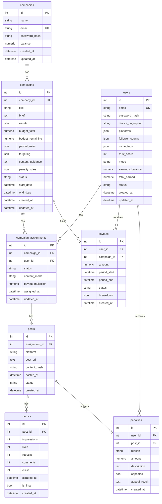

# Database Schema

## Overview

Amplifier uses two separate SQLite/PostgreSQL databases:

| Database | Location | ORM / Driver | Tables |
|----------|----------|--------------|--------|
| **Server-side** | `amplifier.db` (dev) or PostgreSQL (prod) | SQLAlchemy 2.0 async (aiosqlite / asyncpg) | 8 |
| **User-side** | `data/local.db` on the user's device | Python `sqlite3` stdlib (synchronous) | 5 |

The server database is managed through SQLAlchemy's `DeclarativeBase` with `Mapped` type annotations (SQLAlchemy 2.0 style). Tables are auto-created on startup when using SQLite; Alembic handles migrations for PostgreSQL production deployments.

The user-side database is plain SQL via `sqlite3`, created by `scripts/utils/local_db.py`. It uses WAL journal mode for concurrent read/write safety.

---

## Entity Relationship Diagram



---

## Server Database

### companies

| Column | Type | Constraints | Default | Notes |
|--------|------|-------------|---------|-------|
| `id` | Integer | PRIMARY KEY | auto | |
| `name` | String(255) | NOT NULL | | Company display name |
| `email` | String(255) | UNIQUE, INDEX, NOT NULL | | Login email |
| `password_hash` | String(255) | NOT NULL | | bcrypt hash via passlib |
| `balance` | Numeric(12,2) | NOT NULL | `0.0` | Campaign funding balance (USD) |
| `created_at` | DateTime(tz) | NOT NULL | `func.now()` | Server-side default |
| `updated_at` | DateTime(tz) | NOT NULL | `func.now()` | Auto-updates on change via `onupdate=func.now()` |

**Relationships:** One-to-many with `campaigns`.

---

### campaigns

| Column | Type | Constraints | Default | Notes |
|--------|------|-------------|---------|-------|
| `id` | Integer | PRIMARY KEY | auto | |
| `company_id` | Integer | FK(`companies.id`), INDEX, NOT NULL | | |
| `title` | String(255) | NOT NULL | | Campaign title |
| `brief` | Text | NOT NULL | | Full campaign brief for content generation |
| `assets` | JSON | NOT NULL | `{}` | See JSON structure below |
| `budget_total` | Numeric(12,2) | NOT NULL | | Total campaign budget (USD) |
| `budget_remaining` | Numeric(12,2) | NOT NULL | | Decremented as payouts are made |
| `payout_rules` | JSON | NOT NULL | | See JSON structure below |
| `targeting` | JSON | NOT NULL | `{}` | See JSON structure below |
| `content_guidance` | Text | NULLABLE | `None` | Tone, must-include phrases, forbidden phrases |
| `penalty_rules` | JSON | NOT NULL | `{}` | See JSON structure below |
| `status` | String(20) | INDEX, NOT NULL | `"draft"` | `draft` \| `active` \| `paused` \| `completed` \| `cancelled` |
| `start_date` | DateTime(tz) | NOT NULL | | Campaign start |
| `end_date` | DateTime(tz) | NOT NULL | | Campaign end |
| `created_at` | DateTime(tz) | NOT NULL | `func.now()` | |
| `updated_at` | DateTime(tz) | NOT NULL | `func.now()` | Auto-updates via `onupdate` |

**JSON column structures:**

```jsonc
// assets
{
  "image_urls": [],
  "links": [],
  "hashtags": [],
  "brand_guidelines": ""
}

// payout_rules
{
  "rate_per_1k_impressions": 0.50,
  "rate_per_like": 0.01,
  "rate_per_repost": 0.05,
  "rate_per_click": 0.10
}

// targeting
{
  "min_followers": { "x": 100, "linkedin": 50 },
  "niche_tags": ["finance"],
  "required_platforms": ["x", "linkedin"]
}

// penalty_rules
{
  "post_deleted_24h": 5.00,
  "off_brief": 2.00,
  "fake_metrics": 50.00
}
```

**Relationships:** Belongs to `companies`. One-to-many with `campaign_assignments`. One-to-many with `payouts`.

---

### users

| Column | Type | Constraints | Default | Notes |
|--------|------|-------------|---------|-------|
| `id` | Integer | PRIMARY KEY | auto | |
| `email` | String(255) | UNIQUE, INDEX, NOT NULL | | Login email |
| `password_hash` | String(255) | NOT NULL | | bcrypt hash |
| `device_fingerprint` | String(255) | NULLABLE | `None` | Ties account to a single device |
| `platforms` | JSON | NOT NULL | `{}` | See JSON structure below |
| `follower_counts` | JSON | NOT NULL | `{}` | See JSON structure below |
| `niche_tags` | JSON | NOT NULL | `[]` | JSON array of strings |
| `trust_score` | Integer | NOT NULL | `50` | 0-100 scale, affects campaign priority |
| `mode` | String(20) | NOT NULL | `"semi_auto"` | `full_auto` \| `semi_auto` \| `manual` |
| `earnings_balance` | Numeric(12,2) | NOT NULL | `0.0` | Current unpaid balance (USD) |
| `total_earned` | Numeric(12,2) | NOT NULL | `0.0` | Lifetime earnings (USD) |
| `status` | String(20) | INDEX, NOT NULL | `"active"` | `active` \| `suspended` \| `banned` |
| `created_at` | DateTime(tz) | NOT NULL | `func.now()` | |
| `updated_at` | DateTime(tz) | NOT NULL | `func.now()` | Auto-updates via `onupdate` |

**JSON column structures:**

```jsonc
// platforms
{
  "x": { "username": "@handle", "connected": true },
  "linkedin": { "username": "...", "connected": true }
  // Also: facebook, instagram, reddit, tiktok
}

// follower_counts
{
  "x": 1500,
  "linkedin": 500,
  "facebook": 200
  // One entry per connected platform
}

// niche_tags
["finance", "tech", "lifestyle"]
```

**Relationships:** One-to-many with `campaign_assignments`, `payouts`, `penalties`.

---

### campaign_assignments

| Column | Type | Constraints | Default | Notes |
|--------|------|-------------|---------|-------|
| `id` | Integer | PRIMARY KEY | auto | |
| `campaign_id` | Integer | FK(`campaigns.id`), INDEX, NOT NULL | | |
| `user_id` | Integer | FK(`users.id`), INDEX, NOT NULL | | |
| `status` | String(30) | NOT NULL | `"assigned"` | `assigned` \| `content_generated` \| `posted` \| `metrics_collected` \| `paid` \| `skipped` |
| `content_mode` | String(20) | NOT NULL | `"ai_generated"` | `ai_generated` \| `user_customized` \| `repost` |
| `payout_multiplier` | Numeric(3,2) | NOT NULL | `1.5` | 1.0 = repost, 1.5 = AI generated, 2.0 = user customized |
| `assigned_at` | DateTime(tz) | NOT NULL | `func.now()` | |
| `updated_at` | DateTime(tz) | NOT NULL | `func.now()` | Auto-updates via `onupdate` |

**Relationships:** Belongs to `campaigns` and `users`. One-to-many with `posts`.

---

### posts

| Column | Type | Constraints | Default | Notes |
|--------|------|-------------|---------|-------|
| `id` | Integer | PRIMARY KEY | auto | |
| `assignment_id` | Integer | FK(`campaign_assignments.id`), INDEX, NOT NULL | | |
| `platform` | String(20) | NOT NULL | | `x` \| `linkedin` \| `facebook` \| `reddit` \| `tiktok` \| `instagram` |
| `post_url` | Text | NOT NULL | | Full URL of the published post |
| `content_hash` | String(64) | NOT NULL | | SHA-256 hash for duplicate detection |
| `posted_at` | DateTime(tz) | NOT NULL | | Actual posting timestamp |
| `status` | String(20) | NOT NULL | `"live"` | `live` \| `deleted` \| `flagged` |
| `created_at` | DateTime(tz) | NOT NULL | `func.now()` | |

**Relationships:** Belongs to `campaign_assignments`. One-to-many with `metrics`. Optional back-reference from `penalties`.

---

### metrics

| Column | Type | Constraints | Default | Notes |
|--------|------|-------------|---------|-------|
| `id` | Integer | PRIMARY KEY | auto | |
| `post_id` | Integer | FK(`posts.id`), INDEX, NOT NULL | | |
| `impressions` | Integer | NOT NULL | `0` | |
| `likes` | Integer | NOT NULL | `0` | |
| `reposts` | Integer | NOT NULL | `0` | Retweets, shares, reposts depending on platform |
| `comments` | Integer | NOT NULL | `0` | |
| `clicks` | Integer | NOT NULL | `0` | |
| `scraped_at` | DateTime(tz) | NOT NULL | | When the metric scrape occurred |
| `is_final` | Boolean | NOT NULL | `False` | True when 72h post-publication scrape is complete |
| `created_at` | DateTime(tz) | NOT NULL | `func.now()` | |

Multiple metric rows per post are expected (scraped at T+1h, T+6h, T+24h, T+72h). The row with `is_final=True` is used for billing.

**Relationships:** Belongs to `posts`.

---

### payouts

| Column | Type | Constraints | Default | Notes |
|--------|------|-------------|---------|-------|
| `id` | Integer | PRIMARY KEY | auto | |
| `user_id` | Integer | FK(`users.id`), INDEX, NOT NULL | | |
| `campaign_id` | Integer | FK(`campaigns.id`), INDEX, NOT NULL | | |
| `amount` | Numeric(12,2) | NOT NULL | | Payout amount after platform cut (USD) |
| `period_start` | DateTime(tz) | NOT NULL | | Billing period start |
| `period_end` | DateTime(tz) | NOT NULL | | Billing period end |
| `status` | String(20) | NOT NULL | `"pending"` | `pending` \| `processing` \| `paid` \| `failed` |
| `breakdown` | JSON | NOT NULL | `{}` | See JSON structure below |
| `created_at` | DateTime(tz) | NOT NULL | `func.now()` | |

**JSON column structure:**

```jsonc
// breakdown
{
  "impressions_earned": 5.00,
  "likes_earned": 2.00,
  "reposts_earned": 1.00
  // One field per metric type
}
```

**Relationships:** Belongs to `users`.

---

### penalties

| Column | Type | Constraints | Default | Notes |
|--------|------|-------------|---------|-------|
| `id` | Integer | PRIMARY KEY | auto | |
| `user_id` | Integer | FK(`users.id`), INDEX, NOT NULL | | |
| `post_id` | Integer | FK(`posts.id`), NULLABLE | `None` | Null for account-level penalties (not tied to a specific post) |
| `reason` | String(30) | NOT NULL | | `content_removed` \| `off_brief` \| `fake_metrics` \| `platform_violation` |
| `amount` | Numeric(12,2) | NOT NULL | `0.0` | Penalty amount deducted (USD) |
| `description` | Text | NULLABLE | `None` | Human-readable explanation |
| `appealed` | Boolean | NOT NULL | `False` | Whether the user has appealed |
| `appeal_result` | Text | NULLABLE | `None` | Outcome of appeal if reviewed |
| `created_at` | DateTime(tz) | NOT NULL | `func.now()` | |

**Relationships:** Belongs to `users`.

---

## User-Side Database

The user-side SQLite database lives at `data/local.db` relative to the project root. It is created and managed by `scripts/utils/local_db.py` using raw SQL (no ORM). WAL journal mode is enabled on every connection for concurrent read/write safety.

### local_campaign

Mirrors campaign data from the server for offline access and content generation.

| Column | Type | Constraints | Default | Notes |
|--------|------|-------------|---------|-------|
| `server_id` | INTEGER | PRIMARY KEY | | Maps to `campaigns.id` on the server |
| `assignment_id` | INTEGER | UNIQUE | | Maps to `campaign_assignments.id` on the server |
| `title` | TEXT | NOT NULL | | Campaign title |
| `brief` | TEXT | NOT NULL | | Campaign brief for content generation |
| `assets` | TEXT | | `'{}'` | JSON string (image URLs, links, hashtags, brand guidelines) |
| `content_guidance` | TEXT | | | Tone/phrasing rules |
| `payout_rules` | TEXT | | `'{}'` | JSON string (rate per metric) |
| `payout_multiplier` | REAL | | `1.5` | Content mode multiplier |
| `status` | TEXT | | `'assigned'` | Local workflow status |
| `content` | TEXT | | | Generated content (stored after AI generation) |
| `created_at` | TEXT | | `datetime('now')` | ISO 8601 string |
| `updated_at` | TEXT | | `datetime('now')` | ISO 8601 string, updated on each write |

---

### local_post

Tracks posts made from this device, synced to the server after posting.

| Column | Type | Constraints | Default | Notes |
|--------|------|-------------|---------|-------|
| `id` | INTEGER | PRIMARY KEY AUTOINCREMENT | auto | Local post ID |
| `campaign_server_id` | INTEGER | FK(`local_campaign.server_id`) | | Links to the campaign |
| `assignment_id` | INTEGER | | | Server assignment ID (for reporting) |
| `platform` | TEXT | NOT NULL | | `x` \| `linkedin` \| `facebook` \| `reddit` \| `tiktok` \| `instagram` |
| `post_url` | TEXT | | | Full URL of published post (null if posting failed) |
| `content` | TEXT | | | The posted content text |
| `content_hash` | TEXT | | | SHA-256 hash of content |
| `posted_at` | TEXT | | | ISO 8601 timestamp |
| `server_post_id` | INTEGER | | | Assigned by server after sync |
| `synced` | INTEGER | | `0` | 0 = not yet reported to server, 1 = synced |

---

### local_metric

Stores scraped engagement metrics for local posts, reported to the server in batches.

| Column | Type | Constraints | Default | Notes |
|--------|------|-------------|---------|-------|
| `id` | INTEGER | PRIMARY KEY AUTOINCREMENT | auto | |
| `post_id` | INTEGER | FK(`local_post.id`), NOT NULL | | Local post ID |
| `impressions` | INTEGER | | `0` | |
| `likes` | INTEGER | | `0` | |
| `reposts` | INTEGER | | `0` | |
| `comments` | INTEGER | | `0` | |
| `clicks` | INTEGER | | `0` | |
| `scraped_at` | TEXT | NOT NULL | | ISO 8601 timestamp of scrape |
| `is_final` | INTEGER | | `0` | 1 = final (72h) scrape |
| `reported` | INTEGER | | `0` | 0 = not yet sent to server, 1 = reported |

---

### local_earning

Tracks earnings received from the server for dashboard display.

| Column | Type | Constraints | Default | Notes |
|--------|------|-------------|---------|-------|
| `id` | INTEGER | PRIMARY KEY AUTOINCREMENT | auto | |
| `campaign_server_id` | INTEGER | | | Links to campaign |
| `amount` | REAL | | `0.0` | Earning amount (USD) |
| `period` | TEXT | | | Billing period identifier |
| `status` | TEXT | | `'pending'` | `pending` \| `paid` |
| `updated_at` | TEXT | | `datetime('now')` | |

---

### settings

Simple key-value store for user app configuration (server URL, auth tokens, preferences).

| Column | Type | Constraints | Default | Notes |
|--------|------|-------------|---------|-------|
| `key` | TEXT | PRIMARY KEY | | Setting name |
| `value` | TEXT | | | Setting value (all stored as strings) |

---

## Database Configuration

### Server-Side

| Setting | Development | Production |
|---------|-------------|------------|
| **Engine** | SQLite (aiosqlite) | PostgreSQL (asyncpg) |
| **Default URL** | `sqlite+aiosqlite:///./amplifier.db` | Set via `DATABASE_URL` env var |
| **Connection pooling** | `StaticPool` (single connection, required for SQLite async) | SQLAlchemy default pool |
| **SQLite args** | `check_same_thread=False` | N/A |
| **Table creation** | Auto via `init_tables()` on startup | Alembic migrations |
| **Vercel behavior** | SQLite redirected to `/tmp/amplifier.db` | Use PostgreSQL — `/tmp/` is ephemeral per invocation |

The Vercel detection logic in `server/app/core/database.py`:
- If `DATABASE_URL` starts with `sqlite` **and** the `VERCEL` environment variable is set, the database path is overridden to `sqlite+aiosqlite:////tmp/amplifier.db`.
- `/tmp/` on Vercel is the only writable directory but is **ephemeral** — data is lost between cold starts. This is acceptable only for demos; production must use PostgreSQL.

### User-Side

| Setting | Value |
|---------|-------|
| **Engine** | Python `sqlite3` stdlib (synchronous) |
| **Location** | `data/local.db` (relative to project root) |
| **Journal mode** | WAL (`PRAGMA journal_mode=WAL` on every connection) |
| **Row factory** | `sqlite3.Row` (dict-like access) |
| **Directory creation** | `data/` is auto-created if missing via `Path.mkdir(parents=True)` |
