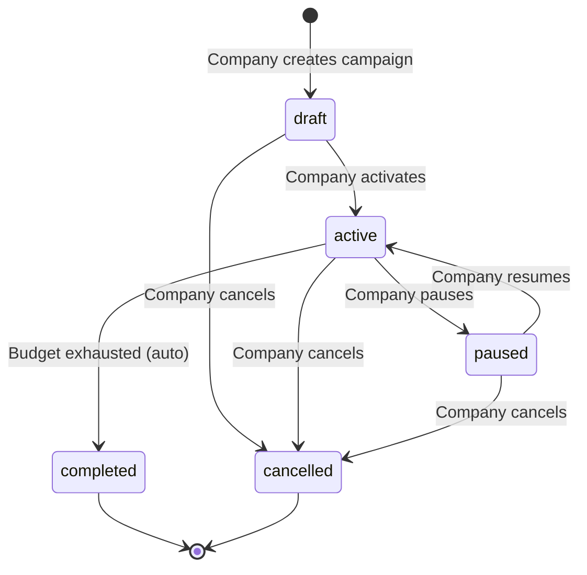
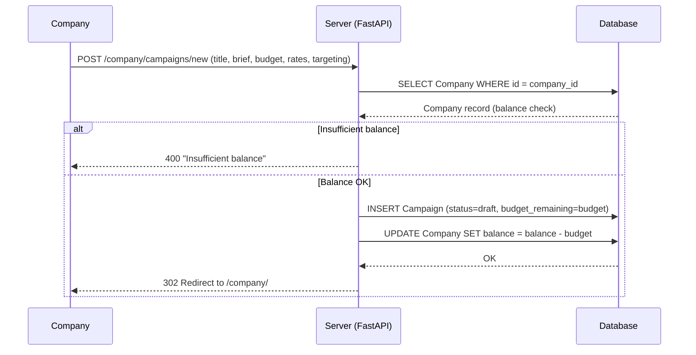
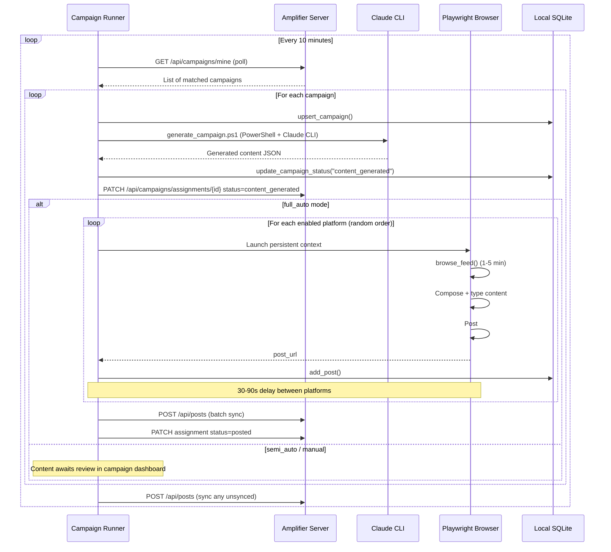
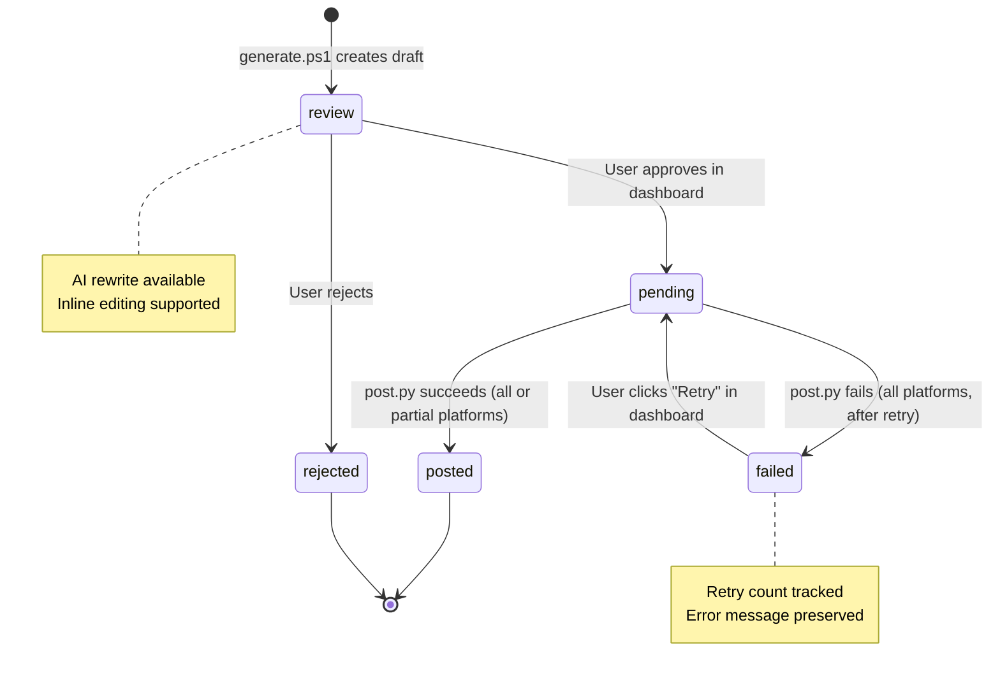
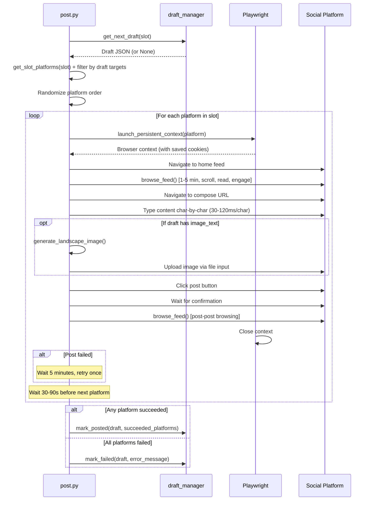
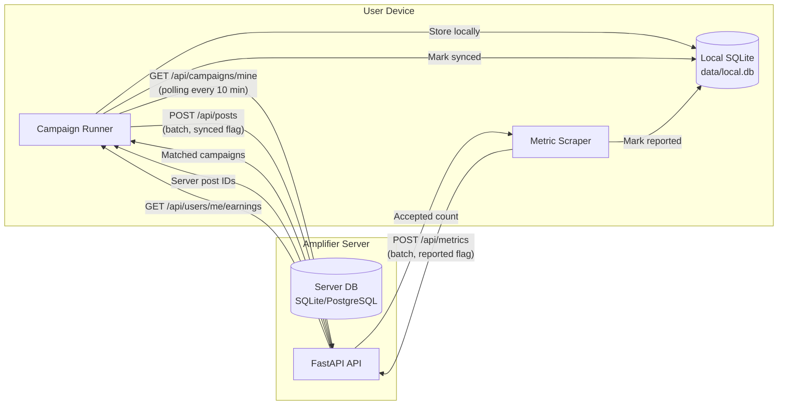

# Amplifier User Flows

This document describes the end-to-end journeys for every actor in the Amplifier ecosystem: companies, users, admins, and the personal brand engine.

---

## Flow 1: Company Journey

A company registers, funds their account, creates campaigns, activates them, and monitors performance through the company dashboard at `/company/`.

### Steps

1. **Register / Login** -- Company submits name, email, and password via `/company/register` or `/company/login`. A JWT is stored as an httpOnly cookie (`company_token`).
2. **Top Up Balance** -- On the billing page (`/company/billing`), the company adds funds. In production this routes through Stripe Checkout; in dev it directly credits the balance.
3. **Create Campaign** -- Via `/company/campaigns/new`, the company fills in title, brief, budget, payout rates (per 1K impressions, per like, per repost, per click), targeting (required platforms, minimum followers, niche tags), content guidance, and start/end dates. The budget is deducted from the company balance. Campaign starts in `draft` status.
4. **Activate Campaign** -- From the campaign detail page (`/company/campaigns/{id}`), the company changes status from `draft` to `active`. Valid transitions are enforced server-side.
5. **Monitor Analytics** -- The campaign detail page shows: total posts, unique users, impressions, engagement, budget spent, budget remaining, and per-platform breakdowns (impressions, likes, reposts, comments, clicks).
6. **Manage Lifecycle** -- The company can pause, resume, or cancel campaigns. Budget auto-completes the campaign when remaining < $1.00.

### Campaign Lifecycle State Diagram

### Campaign Creation Sequence

---

## Flow 2: User Journey (Campaign Mode)

A user installs Amplifier, completes onboarding, then the campaign runner polls for campaigns, generates content, posts to social media, and scrapes metrics to earn money.

### Onboarding (5 Steps)

Defined in `scripts/onboarding.py`:

1. **Account Setup** -- Register or login. Calls `POST /api/auth/register` or `POST /api/auth/login`. JWT stored locally in `config/server_auth.json`.
2. **Connect Platforms** -- For each of 6 platforms (X, LinkedIn, Facebook, Instagram, Reddit, TikTok), launches `login_setup.py` to create a persistent Playwright browser profile in `profiles/{platform}-profile/`. Records username for each.
3. **Profile Setup** -- Enter follower counts per connected platform and choose niche tags (finance, tech, lifestyle, fitness, gaming, education, business, marketing, crypto, health, food, travel, fashion, entertainment).
4. **Operating Mode** -- Choose one of three modes:
   - `full_auto` -- Campaigns are processed and posted automatically. Payout multiplier: **1.5x**. Content mode: `ai_generated`.
   - `semi_auto` -- Content is AI-generated, but the user reviews before posting. Payout multiplier: **2.0x**. Content mode: `user_customized`.
   - `manual` -- User writes their own content from the campaign brief. Payout multiplier: **2.0x**. Content mode: `user_customized`.
5. **Verification** -- Confirms server connectivity, displays email, trust score, mode, connected platforms, and niche tags.

All profile data is sent to the server via `PATCH /api/users/me`.

### Campaign Runner Loop

The `campaign_runner.py` runs as a persistent loop, polling every 10 minutes (configurable via `CAMPAIGN_POLL_INTERVAL_SEC`).

### Metric Scraping

The metric scraper (`scripts/utils/metric_scraper.py`) revisits posted URLs on a schedule:

| Window | Time After Post | Purpose |
|--------|----------------|---------|
| T+1h | 1 hour | Verify post is live |
| T+6h | 6 hours | Early engagement snapshot |
| T+24h | 24 hours | Primary metric |
| T+72h | 72 hours | **Final metric** (used for billing) |

The scraper groups posts by platform, launches one headless browser per platform, scrapes metrics (impressions, likes, reposts, comments, clicks) using platform-specific selectors, stores locally, then syncs to the server via `POST /api/metrics`.

---

## Flow 3: Admin Journey

The admin accesses the dashboard at `/admin/` using a password (default: "admin"). Authentication is cookie-based (`admin_token`).

### Admin Pages

| Page | Route | Purpose |
|------|-------|---------|
| **Login** | `/admin/login` | Password-based authentication |
| **Overview** | `/admin/` | System-wide stats: total users, active users, total campaigns, active campaigns, total posts, total payouts, platform revenue, and the 10 most recent campaign assignments |
| **Users** | `/admin/users` | List all users with trust score, mode, platform count, total earned, and status. Filter by status. Actions: suspend / unsuspend individual users |
| **Campaigns** | `/admin/campaigns` | List all campaigns with company name, status, budget total/remaining, user count, post count. Read-only overview for all companies |
| **Fraud Detection** | `/admin/fraud` | Displays recent penalties (user, reason, amount, description, appeal status). "Run Check" button triggers `run_trust_check()` which runs both deletion fraud detection and metrics anomaly detection, displaying results inline |
| **Payouts** | `/admin/payouts` | Shows total pending, paid, and failed amounts. Lists all payout records with user, campaign, amount, status, and breakdown. "Run Billing" triggers `run_billing_cycle()`. "Run Payout" triggers `run_payout_cycle()` |

### Admin Workflow

1. Login with admin password
2. Check Overview for system health (total users, revenue, recent activity)
3. Review Users page -- look for low trust scores, suspended accounts
4. Run Fraud Detection -- check for anomalies (>3x average engagement) and deletion flags (posts older than 24h marked live)
5. Run Billing -- process final metrics into payout records
6. Run Payouts -- transfer earnings to users (via Stripe Connect when integrated)

---

## Flow 4: Personal Brand Engine

The personal brand engine is the original Amplifier pipeline for posting the user's own content, independent of campaigns.

### Pipeline

1. **Research** -- Gather content ideas from Coda notes, backtests, screenshots, and signals.
2. **Generate** -- `scripts/generate.ps1` invokes Claude CLI (`claude --dangerously-skip-permissions`) to produce draft JSON files in `drafts/review/`. Per-slot generation with pillar rotation, CTA rotation, and legal disclaimers. Supports 6 content pillars and 6 time slots.
3. **Review** -- `scripts/review_dashboard.py` serves a Flask app on port 5111. Platform-by-platform tab view with character counts, inline editing, AI rewrite (sends prompt to Claude CLI), approve/reject/retry, and approve-all. Also shows failed drafts with retry option.
4. **Post** -- `scripts/post.py` picks the next pending draft for the current slot, posts to each platform scheduled for that slot with human behavior emulation, retries once on failure after 5 minutes.
5. **Engage** -- During each posting session, `browse_feed()` spends 1-5 minutes doing realistic browsing, then `auto_engage()` likes/reposts other content (with daily caps and a content blocklist).

### Draft Lifecycle State Diagram

### Posting Flow Sequence

---

## Flow 5: Data Synchronization

The user app and server maintain separate databases with a defined sync protocol. Data flows in specific directions depending on the entity type.

### Sync Direction Summary

| Entity | Direction | Endpoint | Trigger | Dedup Mechanism |
|--------|-----------|----------|---------|-----------------|
| **Campaigns** | Server to Client | `GET /api/campaigns/mine` | Poll every 10 min | `upsert_campaign()` (INSERT OR REPLACE on server_id) |
| **Posts** | Client to Server | `POST /api/posts` | After posting + each poll loop | `synced` flag on local_post (0 = unsynced, 1 = synced). Server returns post IDs mapped back to local records |
| **Metrics** | Client to Server | `POST /api/metrics` | After scrape cycle | `reported` flag on local_metric. Only metrics with a `server_post_id` are eligible for reporting |
| **Earnings** | Server to Client | `GET /api/users/me/earnings` | On-demand (dashboard) | Server is authoritative; local `local_earning` table is a cache |

### Offline Behavior

The local SQLite database (`data/local.db`) allows the user app to operate offline:
- Campaigns are cached locally after first poll
- Posts are recorded locally immediately after posting, synced when connectivity returns
- Metrics are stored locally and batched for server submission
- The `synced` and `reported` flags ensure exactly-once delivery to the server
