# Amplifier User Flows v2

This document describes every end-to-end journey in the Amplifier campaign marketplace. It covers all three apps (User App, Company Dashboard, Admin Dashboard) and the background systems that connect them.

The personal brand engine (generate.ps1, review_dashboard on port 5111, content pillars, CTA rotation) is a separate founder-only tool and is intentionally excluded from this document.

**Date**: 2026-03-24
**Spec reference**: `docs/PRODUCT_SPEC_V2.md`

---

## Table of Contents

1. [User Onboarding Flow](#flow-1-user-onboarding)
2. [Campaign Invitation Flow](#flow-2-campaign-invitation)
3. [Content Generation & Review Flow](#flow-3-content-generation--review)
4. [Post Scheduling & Execution Flow](#flow-4-post-scheduling--execution)
5. [Metric Collection Flow](#flow-5-metric-collection)
6. [Earnings & Payout Flow](#flow-6-earnings--payout)
7. [Company Campaign Creation Flow (AI Wizard)](#flow-7-company-campaign-creation-ai-wizard)
8. [Company Campaign Management Flow](#flow-8-company-campaign-management)
9. [Campaign Edit Propagation Flow](#flow-9-campaign-edit-propagation)
10. [Profile Scraping & Refresh Flow](#flow-10-profile-scraping--refresh)
11. [Session Health Flow](#flow-11-session-health)
12. [Prohibited Content Screening Flow](#flow-12-prohibited-content-screening)
13. [Admin Workflow](#flow-13-admin-workflow)

---

## Flow 1: User Onboarding

The first-launch experience that takes a new user from zero to campaign-ready. Handled entirely by the Amplifier User App (Tauri desktop).

### Steps

| Step | Action | Component | Details |
|------|--------|-----------|---------|
| 1 | **Register or Login** | User App -> Server API | User enters email + password. App calls `POST /api/auth/register` or `POST /api/auth/login`. JWT stored locally in `config/server_auth.json`. |
| 2 | **Connect Platforms** | User App -> Playwright | For each platform (X, LinkedIn, Facebook, Reddit), the app opens a real browser window to the platform login page. User logs in manually. Session cookies saved to `profiles/{platform}-profile/`. No credentials touch Amplifier. |
| 3 | **Profile Scraping** | User App (Background Agent) | Immediately after each platform connect, Amplifier scrapes the user's profile (see [Flow 10](#flow-10-profile-scraping--refresh) for full details). Extracts follower count, bio, recent posts, engagement metrics, posting frequency. |
| 4 | **AI Niche Detection + Confirmation** | User App | AI analyzes scraped post content and bio to classify niches (finance, tech, beauty, fashion, fitness, gaming, food, travel, education, lifestyle, business, health, entertainment, crypto). Results shown as pre-selected checkboxes. User confirms or adjusts. |
| 5 | **Audience Region Selection** | User App | "Where is most of your audience?" — single or multi-select from: US, UK, India, EU, Latin America, Southeast Asia, Global. |
| 6 | **Operating Mode Selection** | User App | User picks one of three modes. Payout is identical regardless of mode — only the workflow differs. |
| 7 | **Verification** | User App -> Server API | Summary screen: email, connected platforms + follower counts, detected niches, region, mode. App sends profile data to server via `PATCH /api/users/me`. User confirms and completes onboarding. |

### Operating Modes

| Mode | Content Generation | Review Required | Posting |
|------|-------------------|-----------------|---------|
| **Semi-auto** (recommended) | AI generates from campaign brief | Yes — user reviews/edits in Posts tab | Automated at scheduled time |
| **Full-auto** | AI generates from campaign brief | No — posts automatically after quality check | Automated at scheduled time |
| **Manual** | User writes from campaign brief | N/A — user submits their own content | Automated at scheduled time |

### Sequence Diagram

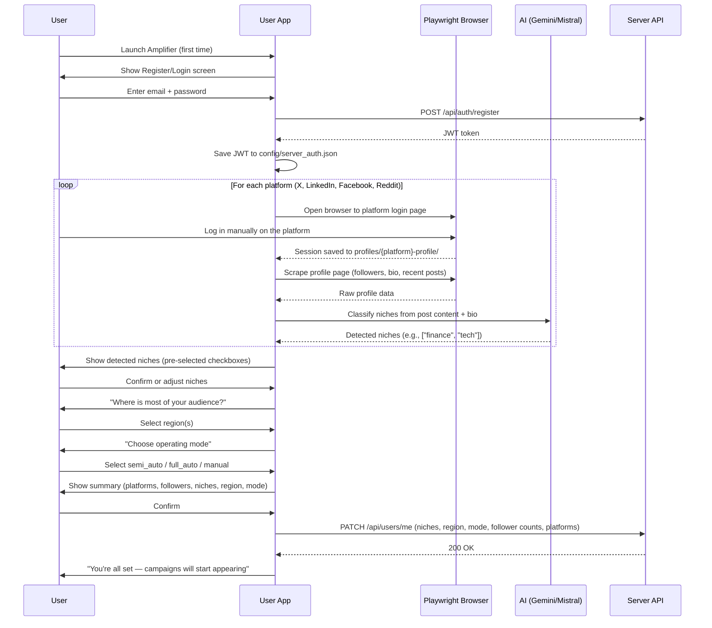
```mermaid
sequenceDiagram
    participant U as User
    participant App as User App
    participant PW as Playwright Browser
    participant AI as AI (Gemini/Mistral)
    participant S as Server API

    U->>App: Launch Amplifier (first time)
    App->>U: Show Register/Login screen

    U->>App: Enter email + password
    App->>S: POST /api/auth/register
    S-->>App: JWT token
    App->>App: Save JWT to config/server_auth.json

    loop For each platform (X, LinkedIn, Facebook, Reddit)
        App->>PW: Open browser to platform login page
        U->>PW: Log in manually on the platform
        PW-->>App: Session saved to profiles/{platform}-profile/
        App->>PW: Scrape profile page (followers, bio, recent posts)
        PW-->>App: Raw profile data
        App->>AI: Classify niches from post content + bio
        AI-->>App: Detected niches (e.g., ["finance", "tech"])
    end

    App->>U: Show detected niches (pre-selected checkboxes)
    U->>App: Confirm or adjust niches

    App->>U: "Where is most of your audience?"
    U->>App: Select region(s)

    App->>U: "Choose operating mode"
    U->>App: Select semi_auto / full_auto / manual

    App->>U: Show summary (platforms, followers, niches, region, mode)
    U->>App: Confirm

    App->>S: PATCH /api/users/me (niches, region, mode, follower counts, platforms)
    S-->>App: 200 OK
    App->>U: "You're all set — campaigns will start appearing"
```

### Error Cases

| Error | Handling |
|-------|----------|
| Registration fails (email taken) | Show error, suggest login instead |
| Server unreachable during register/login | Show "Cannot connect to server" with retry button |
| Platform login fails or times out | Skip platform, show warning. User can connect later from Settings. |
| Profile scraping fails for a platform | Log warning, allow onboarding to continue. Platform marked as connected but profile data incomplete. Retried on next weekly scrape. |
| AI niche detection returns empty | Show all niches unchecked. User must manually select at least one. |
| PATCH /api/users/me fails | Retry with backoff. If persistent, store locally and sync on next app launch. |

---

## Flow 2: Campaign Invitation

How campaigns get from companies to users. This is a server-initiated push model: the server decides who gets invited when a campaign activates.

### Steps

| Step | Action | Component | Details |
|------|--------|-----------|---------|
| 1 | **Company activates campaign** | Company Dashboard -> Server API | Campaign status changes from `draft` to `active`. |
| 2 | **Server runs matching** | Server (matching service) | Hard filters applied first (platforms, followers, niche, region, not suspended, not already invited). Then AI scoring: campaign brief + user profile fed to AI for relevance score 0-100. Trust and engagement bonuses applied. Top N users selected. |
| 3 | **Invitations created** | Server (database) | `CampaignAssignment` records created with status `invited`. Each has a 3-day expiry timestamp. |
| 4 | **User sees invitation** | User App (Campaigns tab > Invitations) | On next poll cycle (every 10 min), user app fetches new invitations. Displayed as cards with: title, brief summary, payout rates, estimated earnings, required platforms, 3-day countdown. |
| 5a | **User accepts** | User App -> Server API | `PATCH /api/campaigns/assignments/{id}` status=`accepted`. Content generation starts immediately (see [Flow 3](#flow-3-content-generation--review)). |
| 5b | **User rejects** | User App -> Server API | `PATCH /api/campaigns/assignments/{id}` status=`rejected`. Permanent for this campaign — user will not be re-invited. Slot freed for another user. |
| 5c | **Invitation expires** | Server (background check) | After 3 days with no response, assignment status set to `expired`. Slot freed. Server can re-run matching to invite other users. |
| 6 | **Max active campaigns enforced** | User App + Server | User cannot accept if they already have 5 active campaigns. Accept button disabled with message: "Complete or drop a campaign to accept new ones." Server enforces the same limit. |

### Sequence Diagram

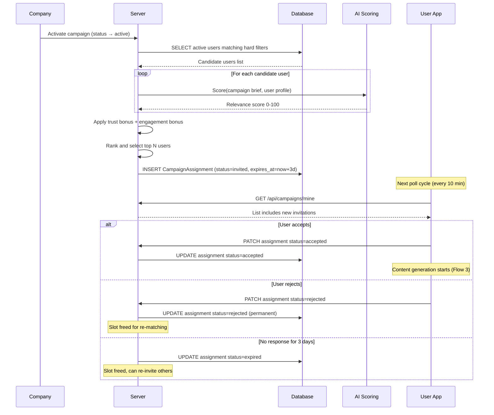
```mermaid
sequenceDiagram
    participant Co as Company
    participant S as Server
    participant DB as Database
    participant AI as AI Scoring
    participant App as User App

    Co->>S: Activate campaign (status → active)
    S->>DB: SELECT active users matching hard filters
    DB-->>S: Candidate users list

    loop For each candidate user
        S->>AI: Score(campaign brief, user profile)
        AI-->>S: Relevance score 0-100
    end

    S->>S: Apply trust bonus + engagement bonus
    S->>S: Rank and select top N users
    S->>DB: INSERT CampaignAssignment (status=invited, expires_at=now+3d)

    Note over App: Next poll cycle (every 10 min)
    App->>S: GET /api/campaigns/mine
    S-->>App: List includes new invitations

    alt User accepts
        App->>S: PATCH assignment status=accepted
        S->>DB: UPDATE assignment status=accepted
        Note over App: Content generation starts (Flow 3)
    else User rejects
        App->>S: PATCH assignment status=rejected
        S->>DB: UPDATE assignment status=rejected (permanent)
        Note over S: Slot freed for re-matching
    else No response for 3 days
        S->>DB: UPDATE assignment status=expired
        Note over S: Slot freed, can re-invite others
    end
```

### Error Cases

| Error | Handling |
|-------|----------|
| User tries to accept but already has 5 active campaigns | Server returns 400. App shows "Max active campaigns reached." |
| User accepts but campaign was paused/cancelled between poll cycles | Server returns 409 conflict. App removes the stale invitation. |
| Server unreachable when accepting/rejecting | Queue action locally. Retry on next poll cycle. |
| Matching returns zero users | Company sees "0 users match your criteria" on campaign detail page. No invitations sent. |

---

## Flow 3: Content Generation & Review

After a user accepts a campaign, AI generates platform-specific content, quality-scores it, and presents it for review (unless full-auto mode).

### Steps

| Step | Action | Component | Details |
|------|--------|-----------|---------|
| 1 | **Campaign brief prepared** | User App | Campaign brief, content guidance, assets, and targeting extracted from the assignment. |
| 2 | **AI generates content** | User App (ContentGenerator) | Brief fed to AI provider chain (Gemini -> Mistral -> Groq fallback). Generates separate content per platform (X: short + hashtags, LinkedIn: professional long-form, Facebook: conversational, Reddit: community-style). Also generates image if applicable (Gemini -> Pollinations -> PIL fallback). |
| 3 | **Quality scoring** | User App | Each platform draft scored 0-100 on: banned phrase detection, platform length limits, emotional hook strength, campaign brief adherence, brand guideline compliance. |
| 4a | **Semi-auto: User reviews** | User App (Posts tab > Pending Review) | Content shown per-platform with quality score. Score below 60 shows warning: "This draft may not perform well. Consider editing or regenerating." |
| 4b | **Full-auto: Auto-approve** | User App (Background Agent) | If all platforms score above 60, content auto-approved and queued for scheduling. If any score below 60, auto-regenerated once. If still below 60, flagged for manual review. |
| 4c | **Manual mode: User writes** | User App (Posts tab) | User sees campaign brief and writes their own content per platform. No AI generation. |
| 5 | **User actions (semi-auto/manual)** | User App | Edit per platform independently, regenerate per platform with AI (one click), approve all or individual platforms, skip (decline to post this campaign). |
| 6 | **Content approved** | User App -> Server API | Status moves to `approved`. Assignment updated. Scheduling begins (see [Flow 4](#flow-4-post-scheduling--execution)). |

### Campaign Edit Re-Review

If the company edits an active campaign (see [Flow 9](#flow-9-campaign-edit-propagation)):
- Content that was approved but not yet posted gets flagged: "Campaign updated -- please re-review"
- User sees the flag in their Posts tab and must re-approve
- Content that was not yet generated uses the updated brief automatically

### Sequence Diagram

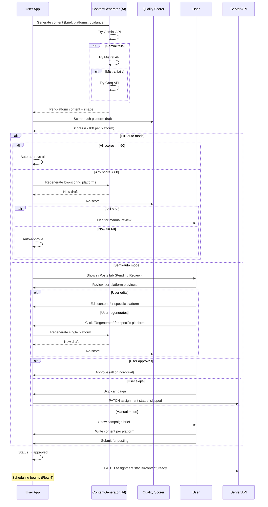
```mermaid
sequenceDiagram
    participant App as User App
    participant CG as ContentGenerator (AI)
    participant QS as Quality Scorer
    participant U as User
    participant S as Server API

    App->>CG: Generate content (brief, platforms, guidance)
    CG->>CG: Try Gemini API
    alt Gemini fails
        CG->>CG: Try Mistral API
        alt Mistral fails
            CG->>CG: Try Groq API
        end
    end
    CG-->>App: Per-platform content + image

    App->>QS: Score each platform draft
    QS-->>App: Scores (0-100 per platform)

    alt Full-auto mode
        alt All scores >= 60
            App->>App: Auto-approve all
        else Any score < 60
            App->>CG: Regenerate low-scoring platforms
            CG-->>App: New drafts
            App->>QS: Re-score
            alt Still < 60
                App->>U: Flag for manual review
            else Now >= 60
                App->>App: Auto-approve
            end
        end
    else Semi-auto mode
        App->>U: Show in Posts tab (Pending Review)
        U->>App: Review per-platform previews

        alt User edits
            U->>App: Edit content for specific platform
        else User regenerates
            U->>App: Click "Regenerate" for specific platform
            App->>CG: Regenerate single platform
            CG-->>App: New draft
            App->>QS: Re-score
        end

        alt User approves
            U->>App: Approve (all or individual)
        else User skips
            U->>App: Skip campaign
            App->>S: PATCH assignment status=skipped
        end
    else Manual mode
        App->>U: Show campaign brief
        U->>App: Write content per platform
        U->>App: Submit for posting
    end

    App->>App: Status → approved
    App->>S: PATCH assignment status=content_ready
    Note over App: Scheduling begins (Flow 4)
```

### Error Cases

| Error | Handling |
|-------|----------|
| All AI providers fail | Show error: "Content generation unavailable. Try again later or switch to manual mode." |
| Image generation fails | Post text-only. Show note: "Image could not be generated." User can attach their own. |
| Quality score below 60 | Warning displayed. User can still approve manually (their choice). |
| Content generation times out | Retry once. If persistent, mark campaign as "generation_failed" locally. User can retry from Posts tab. |
| Campaign brief is empty/malformed | Generate generic campaign content with a warning. Flag to user for manual editing. |

---

## Flow 4: Post Scheduling & Execution

Once content is approved, Amplifier determines the optimal posting time and executes headlessly in the background.

### Steps

| Step | Action | Component | Details |
|------|--------|-----------|---------|
| 1 | **Content approved** | User App | From Flow 3. Content for one or more platforms is ready to post. |
| 2 | **Scheduling engine runs** | User App (Background Agent) | Determines optimal post times based on: campaign target region (e.g., US peak hours for a US campaign), minimum 30-minute spacing between campaign posts, platform variety (avoid same platform back-to-back for different campaigns), randomized offset within time windows to avoid patterns. |
| 3 | **Content queued as "scheduled"** | User App (local DB) | Each platform post gets a `scheduled_at` timestamp. Visible in Posts tab > Scheduled section. User can reschedule or cancel before the post time. |
| 4 | **Background agent executes at scheduled time** | User App (Background Agent -> Playwright) | Headless Playwright launches with the platform's persistent profile. Human behavior emulation: pre-post browsing (1-5 min), char-by-char typing (30-120ms per char), random scrolling, natural mouse movements. Content posted, image uploaded if applicable. |
| 5a | **Success** | User App -> Server API | Post URL captured from the platform. Post marked as `posted` locally. Synced to server via `POST /api/posts`. Assignment status updated. |
| 5b | **Failure** | User App | Post marked as `failed` with error reason. User alerted immediately (desktop notification). Retry button available in Posts tab > Failed section. |
| 5c | **Session expired** | User App | Platform session detected as invalid during posting attempt. Post marked `failed` with reason "session_expired". User alerted: "Your {platform} session has expired. Click to re-authenticate." Other platforms in the same campaign still post normally. |
| 6 | **Metric collection begins** | User App (Background Agent) | After successful post, metric scraping scheduled at T+1h, 6h, 24h, 72h (see [Flow 5](#flow-5-metric-collection)). |

### Scheduling Rules

1. Look at all approved content across all active campaigns
2. Determine optimal windows per platform based on each campaign's target region:
   - US campaigns: post during 8AM-10PM EST
   - UK campaigns: post during 8AM-10PM GMT
   - Global: spread across multiple windows
3. Space posts minimum 30 minutes apart (across all campaigns)
4. Limit campaign posts per day based on active campaign count and platforms
5. Alternate platforms when multiple campaigns are posting (avoid two X posts back-to-back)
6. Add random jitter (+/- 5-15 min) to avoid mechanical patterns

### Sequence Diagram

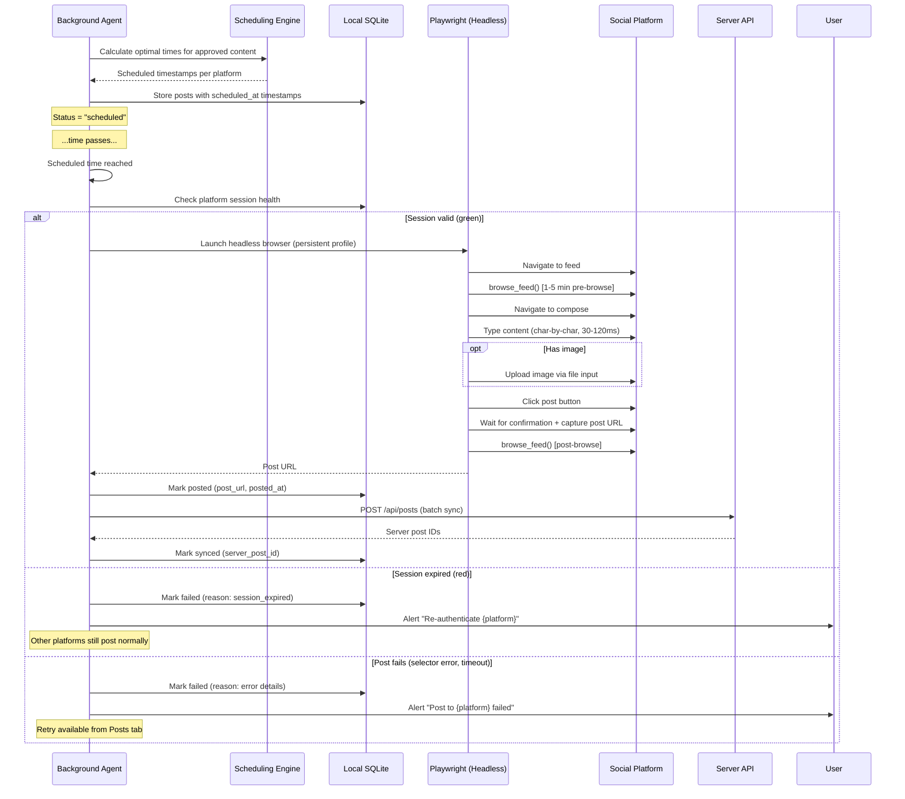
```mermaid
sequenceDiagram
    participant Agent as Background Agent
    participant Sched as Scheduling Engine
    participant DB as Local SQLite
    participant PW as Playwright (Headless)
    participant Platform as Social Platform
    participant S as Server API
    participant U as User

    Agent->>Sched: Calculate optimal times for approved content
    Sched-->>Agent: Scheduled timestamps per platform

    Agent->>DB: Store posts with scheduled_at timestamps
    Note over Agent: Status = "scheduled"

    Note over Agent: ...time passes...

    Agent->>Agent: Scheduled time reached
    Agent->>DB: Check platform session health
    alt Session valid (green)
        Agent->>PW: Launch headless browser (persistent profile)
        PW->>Platform: Navigate to feed
        PW->>Platform: browse_feed() [1-5 min pre-browse]
        PW->>Platform: Navigate to compose
        PW->>Platform: Type content (char-by-char, 30-120ms)
        opt Has image
            PW->>Platform: Upload image via file input
        end
        PW->>Platform: Click post button
        PW->>Platform: Wait for confirmation + capture post URL
        PW->>Platform: browse_feed() [post-browse]
        PW-->>Agent: Post URL

        Agent->>DB: Mark posted (post_url, posted_at)
        Agent->>S: POST /api/posts (batch sync)
        S-->>Agent: Server post IDs
        Agent->>DB: Mark synced (server_post_id)
    else Session expired (red)
        Agent->>DB: Mark failed (reason: session_expired)
        Agent->>U: Alert "Re-authenticate {platform}"
        Note over Agent: Other platforms still post normally
    else Post fails (selector error, timeout)
        Agent->>DB: Mark failed (reason: error details)
        Agent->>U: Alert "Post to {platform} failed"
        Note over Agent: Retry available from Posts tab
    end
```

### Error Cases

| Error | Handling |
|-------|----------|
| Session expired before posting | Post marked failed with "session_expired". Alert sent. Other platforms unaffected. Auto-retry queued after user re-authenticates. |
| Selector not found (platform UI changed) | Post marked failed with "selector_error". Alert sent. Retry available. |
| Timeout during posting | One retry after 5 minutes. If still fails, marked as failed. |
| Image upload fails | Post text-only as fallback. Log warning. |
| All platforms fail for a campaign post | Campaign assignment status stays at `content_ready`. All individual platform posts in Failed section. |
| User reschedules a post | New `scheduled_at` timestamp set. Must still respect 30-min spacing. |
| User cancels a scheduled post | Post removed from queue. Status set to `cancelled`. Does not affect other platforms for the same campaign. |

---

## Flow 5: Metric Collection

After a post is published, Amplifier revisits the post URL at defined intervals to scrape engagement data. The T+72h reading is the final metric used for billing.

### Scrape Schedule

| Window | Time After Post | Purpose |
|--------|----------------|---------|
| T+1h | 1 hour | Verify post is live, early signal |
| T+6h | 6 hours | Early engagement snapshot |
| T+24h | 24 hours | Primary engagement reading |
| T+72h | 72 hours | **Final metric** — triggers billing |

### Steps

| Step | Action | Component | Details |
|------|--------|-----------|---------|
| 1 | **Post published** | User App | Post URL and platform stored locally. Scrape schedule created: four timestamps (T+1h, T+6h, T+24h, T+72h). |
| 2 | **Scrape at each interval** | User App (Background Agent -> MetricCollector) | Agent checks for posts due for scraping. Groups by platform for efficiency (one browser session per platform batch). |
| 3 | **Platform-specific collection** | MetricCollector | X: API v2 (bearer token) if available, else Playwright scraper. Reddit: PRAW API if available, else Playwright scraper. LinkedIn: Playwright scraper. Facebook: Playwright scraper. |
| 4 | **Metrics stored locally** | User App (local DB) | Impressions, likes, reposts, comments, clicks stored per post per scrape window. |
| 5 | **Metrics synced to server** | User App -> Server API | `POST /api/metrics` (batch). Only metrics with a `server_post_id` are eligible. `reported` flag prevents duplicate submissions. |
| 6 | **T+72h marked final** | User App + Server | The 72-hour metric is flagged as `is_final=True`. This triggers the billing cycle on the server (see [Flow 6](#flow-6-earnings--payout)). |

### Sequence Diagram

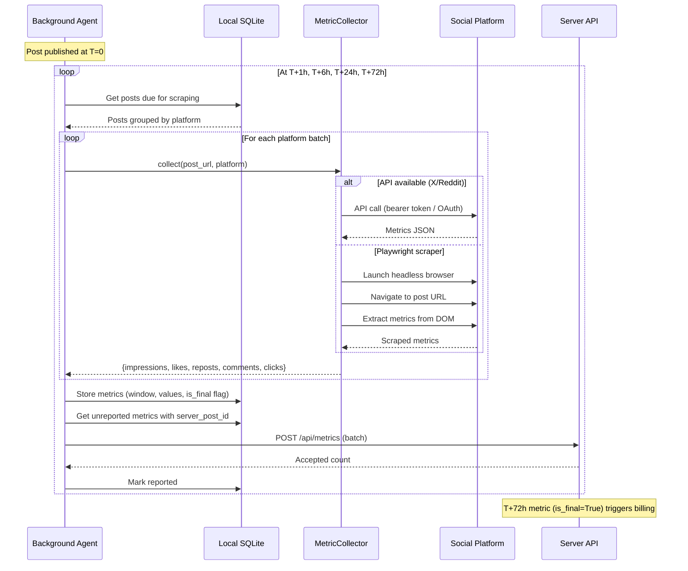
```mermaid
sequenceDiagram
    participant Agent as Background Agent
    participant DB as Local SQLite
    participant MC as MetricCollector
    participant Platform as Social Platform
    participant S as Server API

    Note over Agent: Post published at T=0

    loop At T+1h, T+6h, T+24h, T+72h
        Agent->>DB: Get posts due for scraping
        DB-->>Agent: Posts grouped by platform

        loop For each platform batch
            Agent->>MC: collect(post_url, platform)

            alt API available (X/Reddit)
                MC->>Platform: API call (bearer token / OAuth)
                Platform-->>MC: Metrics JSON
            else Playwright scraper
                MC->>Platform: Launch headless browser
                MC->>Platform: Navigate to post URL
                MC->>Platform: Extract metrics from DOM
                Platform-->>MC: Scraped metrics
            end

            MC-->>Agent: {impressions, likes, reposts, comments, clicks}
        end

        Agent->>DB: Store metrics (window, values, is_final flag)

        Agent->>DB: Get unreported metrics with server_post_id
        Agent->>S: POST /api/metrics (batch)
        S-->>Agent: Accepted count
        Agent->>DB: Mark reported
    end

    Note over S: T+72h metric (is_final=True) triggers billing
```

### Error Cases

| Error | Handling |
|-------|----------|
| Post URL returns 404 (post deleted) | Record deletion. Mark post as `deleted`. Triggers trust score penalty on server. No further scrapes scheduled. |
| Platform session expired during scraping | Skip this platform's posts. Schedule retry for next cycle. Alert user. |
| API rate limit hit (X/Reddit) | Fall back to Playwright scraper for this batch. |
| Metric values seem anomalous (e.g., 1M impressions from 100-follower account) | Store as-is locally. Server-side fraud detection handles anomalies (see [Flow 13](#flow-13-admin-workflow)). |
| Server unreachable during sync | Metrics stay locally with `reported=0`. Retried on next scrape cycle or poll loop. |
| Scrape window missed (app was closed) | Run on next app launch. Metrics still valid — just collected late. |

---

## Flow 6: Earnings & Payout

How metrics turn into money for the user.

### Billing Formula

```
earning = (impressions / 1000 * rate_per_1k_impressions)
        + (likes * rate_per_like)
        + (reposts * rate_per_repost)
        + (clicks * rate_per_click)

user_receives = earning * 80%
amplifier_keeps = earning * 20%
```

Earnings depend purely on engagement metrics. Operating mode (full_auto / semi_auto / manual) does not affect the payout amount.

### Steps

| Step | Action | Component | Details |
|------|--------|-----------|---------|
| 1 | **Final metrics arrive** | Server | T+72h metric marked `is_final=True` synced from user app. |
| 2 | **Billing cycle runs** | Server (billing service) | Processes all posts with final metrics that have not been billed yet. Calculates earnings per post using the campaign's payout rules. |
| 3 | **User balance credited** | Server (database) | 80% of earnings credited to user's withdrawable balance. 20% retained as Amplifier platform fee. |
| 4 | **Campaign budget decremented** | Server (database) | Full earning amount (100%) deducted from campaign's `budget_remaining`. If budget drops below $1, campaign auto-pauses or auto-completes (per company preference). |
| 5 | **User sees earnings** | User App (Earnings tab) | Balance, pending, per-campaign breakdown, per-platform breakdown all visible. Earnings tab updates on next poll or on-demand refresh. |
| 6 | **User requests withdrawal** | User App -> Server API | Available when balance > $10. User clicks "Withdraw" in Earnings tab. |
| 7 | **Payout processed** | Server (payments service) | Payout record created. Processed via Stripe Connect (skeleton for now). Status tracked: pending -> processing -> paid (or failed). |

### Sequence Diagram

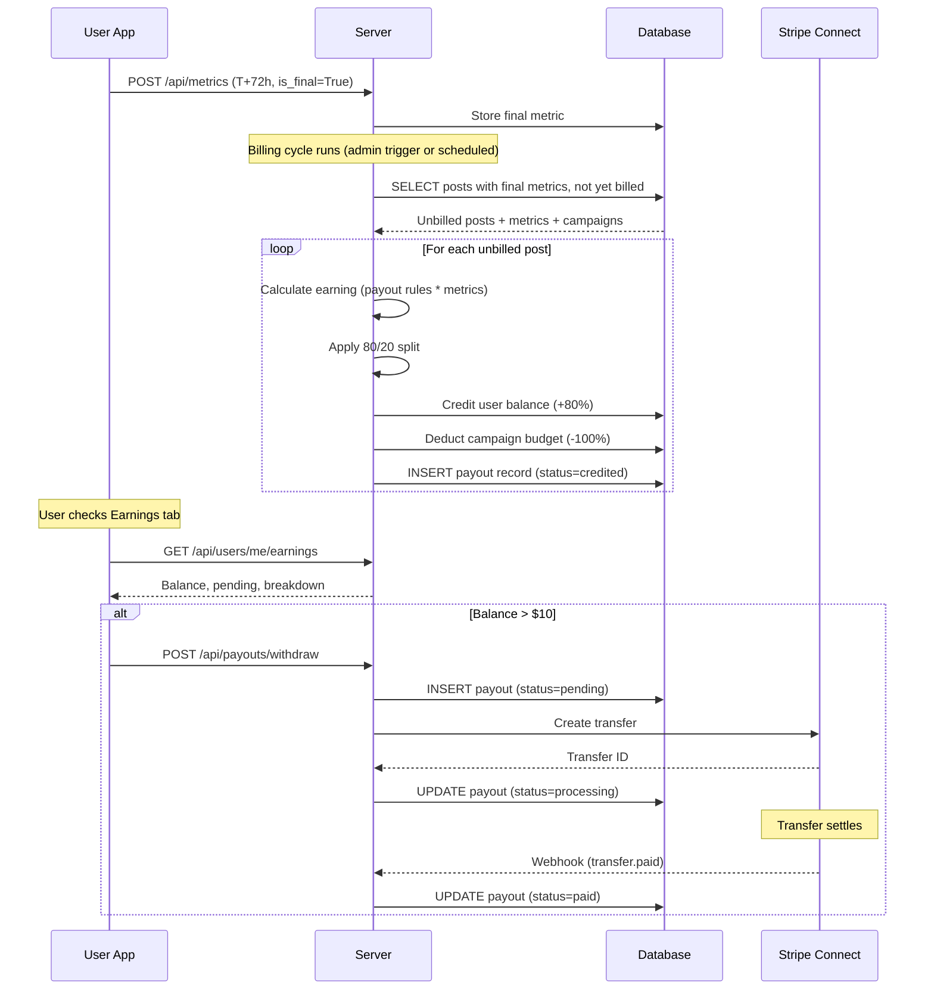
```mermaid
sequenceDiagram
    participant App as User App
    participant S as Server
    participant DB as Database
    participant Stripe as Stripe Connect

    App->>S: POST /api/metrics (T+72h, is_final=True)
    S->>DB: Store final metric

    Note over S: Billing cycle runs (admin trigger or scheduled)

    S->>DB: SELECT posts with final metrics, not yet billed
    DB-->>S: Unbilled posts + metrics + campaigns

    loop For each unbilled post
        S->>S: Calculate earning (payout rules * metrics)
        S->>S: Apply 80/20 split
        S->>DB: Credit user balance (+80%)
        S->>DB: Deduct campaign budget (-100%)
        S->>DB: INSERT payout record (status=credited)
    end

    Note over App: User checks Earnings tab
    App->>S: GET /api/users/me/earnings
    S-->>App: Balance, pending, breakdown

    alt Balance > $10
        App->>S: POST /api/payouts/withdraw
        S->>DB: INSERT payout (status=pending)
        S->>Stripe: Create transfer
        Stripe-->>S: Transfer ID
        S->>DB: UPDATE payout (status=processing)

        Note over Stripe: Transfer settles
        Stripe-->>S: Webhook (transfer.paid)
        S->>DB: UPDATE payout (status=paid)
    end
```

### Error Cases

| Error | Handling |
|-------|----------|
| Final metrics missing (scraping failed) | Post stays unbilled. Manual scrape retry available. Admin can trigger re-scrape. |
| Campaign budget exhausted mid-billing | Remaining budget split proportionally across unbilled posts. Campaign auto-pauses or auto-completes. Company alerted. |
| Payout fails (Stripe error) | Payout status set to `failed`. Balance remains credited. User can retry. Admin sees failed payouts in dashboard. |
| User requests withdrawal with balance < $10 | Server returns 400. App disables withdraw button. |
| Duplicate billing attempted | Server tracks billed metric IDs in payout breakdown JSON. Duplicate metrics skipped. |

---

## Flow 7: Company Campaign Creation (AI Wizard)

A step-by-step AI-guided wizard that walks companies through creating a campaign on the Company Dashboard (web).

### Steps

#### Step 1: Campaign Basics

| Field | Input | AI Assist |
|-------|-------|-----------|
| Product/service | Text input | AI asks: "What product or service are you promoting?" |
| Goal | Select: Brand awareness, Product launch, Event promotion, Lead generation | AI asks: "What's the main goal?" |
| Company/product URLs | URL inputs | Amplifier scrapes pages: company description, product details, brand voice, key selling points, images, pricing. AI pre-fills campaign brief from scraped data. |

#### Step 2: Target Audience

| Field | Input | Details |
|-------|-------|---------|
| Niches | Multi-select checkboxes | finance, tech, beauty, fashion, fitness, gaming, food, travel, education, lifestyle, business, health, entertainment, crypto |
| Regions | Multi-select checkboxes | US, UK, India, EU, Latin America, Southeast Asia, Global |
| Platforms | Multi-select checkboxes | X, LinkedIn, Facebook, Reddit |
| Min followers | Number input per platform | Minimum follower count required on each selected platform |

#### Step 3: Content Direction

| Field | Input | Details |
|-------|-------|---------|
| Tone | Select (multiple OK) | Professional, Casual, Funny, Educational, Inspirational |
| Must-include | Text input | Required phrases, links, hashtags |
| Avoid | Text input | Prohibited phrases, topics, competitor mentions |

#### Step 4: Budget & Payout

| Field | Input | AI Assist |
|-------|-------|-----------|
| Budget | Number input (min $50) | AI suggests: "Based on ~47 matching users with estimated reach of 150K-300K impressions, we recommend $200-500." |
| Rate per 1K impressions | Number input | AI suggests based on industry averages |
| Rate per like | Number input | AI suggests |
| Rate per repost | Number input | AI suggests |
| Rate per click | Number input | AI suggests |
| Start date | Date picker | |
| End date | Date picker | |

#### Step 5: Review & Edit

- AI generates the complete campaign: title, description, content guidance, targeting summary, payout rules, budget allocation
- Company reviews and can edit any field directly
- Preview shows how the campaign invitation will appear to users
- Save as draft (edit later) or activate immediately

#### Step 6: Reach Estimation

Before activation, the system shows:
- Estimated matching users (e.g., "~47 users match your criteria")
- Estimated reach (e.g., "150K-300K impressions")
- Estimated cost (e.g., "$150-350")
- Updates live as targeting parameters change

### Sequence Diagram

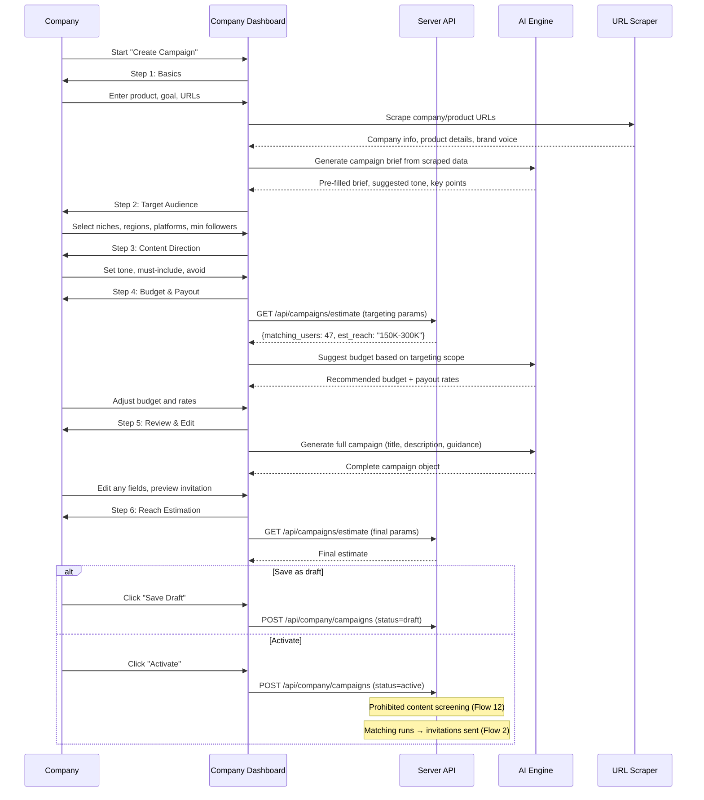
```mermaid
sequenceDiagram
    participant Co as Company
    participant Dash as Company Dashboard
    participant S as Server API
    participant AI as AI Engine
    participant Scraper as URL Scraper

    Co->>Dash: Start "Create Campaign"
    Dash->>Co: Step 1: Basics

    Co->>Dash: Enter product, goal, URLs
    Dash->>Scraper: Scrape company/product URLs
    Scraper-->>Dash: Company info, product details, brand voice
    Dash->>AI: Generate campaign brief from scraped data
    AI-->>Dash: Pre-filled brief, suggested tone, key points

    Dash->>Co: Step 2: Target Audience
    Co->>Dash: Select niches, regions, platforms, min followers

    Dash->>Co: Step 3: Content Direction
    Co->>Dash: Set tone, must-include, avoid

    Dash->>Co: Step 4: Budget & Payout
    Dash->>S: GET /api/campaigns/estimate (targeting params)
    S-->>Dash: {matching_users: 47, est_reach: "150K-300K"}
    Dash->>AI: Suggest budget based on targeting scope
    AI-->>Dash: Recommended budget + payout rates
    Co->>Dash: Adjust budget and rates

    Dash->>Co: Step 5: Review & Edit
    Dash->>AI: Generate full campaign (title, description, guidance)
    AI-->>Dash: Complete campaign object
    Co->>Dash: Edit any fields, preview invitation

    Dash->>Co: Step 6: Reach Estimation
    Dash->>S: GET /api/campaigns/estimate (final params)
    S-->>Dash: Final estimate

    alt Save as draft
        Co->>Dash: Click "Save Draft"
        Dash->>S: POST /api/company/campaigns (status=draft)
    else Activate
        Co->>Dash: Click "Activate"
        Dash->>S: POST /api/company/campaigns (status=active)
        Note over S: Prohibited content screening (Flow 12)
        Note over S: Matching runs → invitations sent (Flow 2)
    end
```

### Error Cases

| Error | Handling |
|-------|----------|
| URL scraping fails (site blocks, timeout) | Skip scraping, let company fill in details manually. Show note: "Could not access URL." |
| Insufficient company balance for budget | Block activation. Show "Insufficient balance — top up on billing page." |
| Budget below $50 minimum | Validation error. "Minimum campaign budget is $50." |
| No matching users for targeting criteria | Show "0 users match these criteria. Try broadening your targeting." Allow saving as draft. |
| Campaign flagged by prohibited content screening | Campaign saved as draft with flag. "This campaign requires admin review before activation." (See [Flow 12](#flow-12-prohibited-content-screening).) |

---

## Flow 8: Company Campaign Management

How companies monitor and manage active campaigns through the Company Dashboard.

### Campaign List View

Companies see all their campaigns with:
- Status badge: draft, active, paused, completed, cancelled
- Quick stats: users reached, total posts, impressions, engagement, budget spent/remaining
- Actions: View, Edit, Pause, Resume, Cancel, Clone
- Filter by status, sort by date/budget/performance

### Campaign Detail View

| Section | Content |
|---------|---------|
| **Overview Stats** | Impressions, engagement, posts, unique users, budget spent, budget remaining, cost per impression, cost per engagement |
| **Budget Progress Bar** | Visual spend tracker. Alert at 80% spent. |
| **Invitation Status** | Users invited / accepted / rejected / expired / pending |
| **Per-User Performance** | Table: display name, platforms posted to, post URLs, per-post metrics (impressions, likes, reposts, comments), total earned, assignment status |
| **Per-Platform Breakdown** | Which platforms deliver best ROI |
| **Timeline** | Chronological log: invitations sent, posts published, metrics collected |

### Campaign Lifecycle Actions

| Action | When Available | Effect |
|--------|---------------|--------|
| **Edit** | Draft or Active | Update brief, guidance, budget (increase only), end date, payout rates. See [Flow 9](#flow-9-campaign-edit-propagation) for propagation rules. |
| **Pause** | Active | Stops new invitations and posting. Existing posts and metrics continue. Can resume. |
| **Resume** | Paused | Re-activates the campaign. Re-runs matching for new invitations. |
| **Cancel** | Draft, Active, or Paused | Permanently ends the campaign. Unused budget refunded to company balance. Existing posts and earned metrics still billed. |
| **Clone** | Any status | Creates a copy with new dates and budget. Pre-fills all fields from the original. Starts as draft. |
| **Budget Top-Up** | Active or Paused | Increase budget without creating a new campaign. New funds available immediately. |
| **Export Report** | Any status | Download CSV or PDF: campaign details, per-user breakdown, per-platform stats, timeline, spend summary. Filterable by date range. |

### Campaign Lifecycle State Diagram

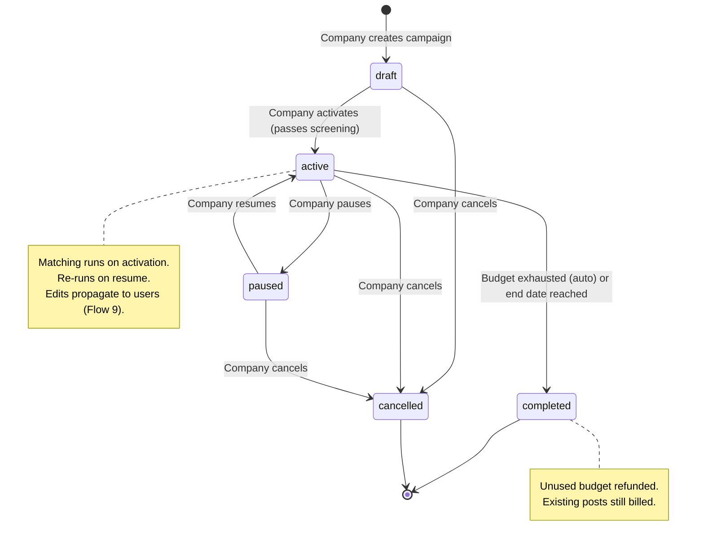
```mermaid
stateDiagram-v2
    [*] --> draft : Company creates campaign
    draft --> active : Company activates (passes screening)
    draft --> cancelled : Company cancels
    active --> paused : Company pauses
    active --> cancelled : Company cancels
    active --> completed : Budget exhausted (auto) or end date reached
    paused --> active : Company resumes
    paused --> cancelled : Company cancels
    completed --> [*]
    cancelled --> [*]

    note right of active
        Matching runs on activation.
        Re-runs on resume.
        Edits propagate to users (Flow 9).
    end note

    note right of completed
        Unused budget refunded.
        Existing posts still billed.
    end note
```

### Error Cases

| Error | Handling |
|-------|----------|
| Edit attempt changes targeting criteria | Server rejects. "Targeting cannot be changed on active campaigns — it would invalidate existing matches." |
| Budget decrease attempt | Server rejects. "Budget can only be increased for active campaigns." |
| Cancel with pending payouts | Campaign cancelled. Pending payouts still processed. Unused budget refunded after all payouts settle. |
| Export times out (large campaign) | Generate async. Email download link when ready (future). For now, paginate. |

---

## Flow 9: Campaign Edit Propagation

When a company edits an active campaign, the changes must propagate to users in different states. This flow ensures already-posted content is untouched, approved content is flagged, and future content uses the new brief.

### Propagation Rules

| Content State | What Happens | User Action Needed |
|---------------|-------------|-------------------|
| **Already posted** | Untouched. Earnings calculated on original terms. | None |
| **Approved but not yet posted** | Flagged: "Campaign updated -- please re-review" | User must re-approve before posting proceeds |
| **Scheduled (waiting to post)** | Moved back to "Pending Review" with flag | User must re-approve |
| **Not yet generated** | New brief used automatically | None (transparent) |
| **Currently generating** | Generation completes with old brief. Next generation uses new brief. | May see re-review flag if timing overlaps |

### What Companies Can Edit

| Field | Editable When Active | Notes |
|-------|---------------------|-------|
| Brief / description | Yes | Triggers re-review for approved content |
| Content guidance | Yes | Triggers re-review for approved content |
| Budget | Increase only | Immediate effect |
| End date | Yes | Can extend or shorten |
| Payout rates | Yes | Only affects future posts, not already-billed |
| Targeting criteria | No | Would invalidate existing matches |

### Sequence Diagram

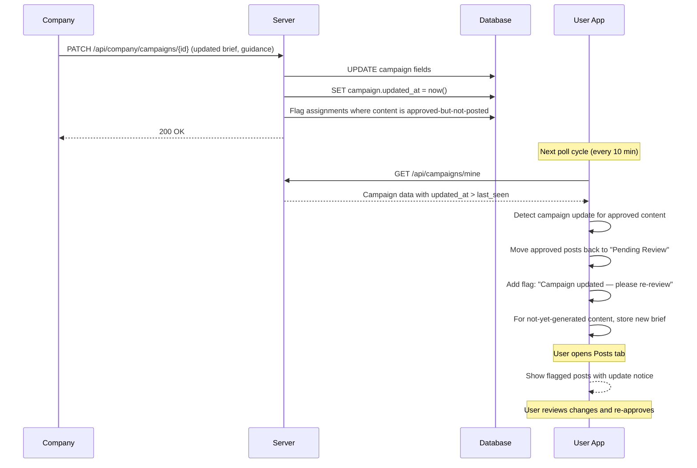
```mermaid
sequenceDiagram
    participant Co as Company
    participant S as Server
    participant DB as Database
    participant App as User App

    Co->>S: PATCH /api/company/campaigns/{id} (updated brief, guidance)
    S->>DB: UPDATE campaign fields
    S->>DB: SET campaign.updated_at = now()
    S->>DB: Flag assignments where content is approved-but-not-posted
    S-->>Co: 200 OK

    Note over App: Next poll cycle (every 10 min)
    App->>S: GET /api/campaigns/mine
    S-->>App: Campaign data with updated_at > last_seen

    App->>App: Detect campaign update for approved content
    App->>App: Move approved posts back to "Pending Review"
    App->>App: Add flag: "Campaign updated — please re-review"

    App->>App: For not-yet-generated content, store new brief

    Note over App: User opens Posts tab
    App-->>App: Show flagged posts with update notice
    Note over App: User reviews changes and re-approves
```

### Error Cases

| Error | Handling |
|-------|----------|
| User misses the re-review flag | Scheduled posts are moved back to Pending Review, so they cannot post without re-approval. No stale content goes out. |
| Poll cycle delayed (app closed) | Flags accumulate server-side. All applied when app reconnects. |
| Company edits while content is mid-generation | Current generation completes with old brief. Content will be flagged for re-review on the next poll if the campaign updated_at is newer. |
| Payout rate change for in-progress posts | Old rates apply to already-billed posts. New rates apply to posts billed after the change. Clear cutoff: billing uses the rates that were active when the final metric was recorded. |

---

## Flow 10: Profile Scraping & Refresh

How Amplifier gathers and maintains user profile data for matching and analytics. All scraping happens on the user's device using their authenticated browser sessions.

### Scrape Triggers

| Trigger | When | Initiated By |
|---------|------|-------------|
| **Platform connect** | Immediately after user logs into a platform during onboarding or Settings | User App (automatic) |
| **Weekly refresh** | Every 7 days per platform | Background Agent (automatic) |
| **Manual refresh** | User clicks "Refresh" in Settings > Profile | User (on-demand) |

### Data Extracted

| Data Point | Source | Method |
|------------|--------|--------|
| Follower count | Profile page | Playwright scraper |
| Following count | Profile page | Playwright scraper |
| Bio / about text | Profile page | Playwright scraper |
| Display name | Profile page | Playwright scraper |
| Profile picture URL | Profile page | Playwright scraper |
| Recent posts (30-60 days) | Profile / feed page | Playwright scraper |
| Per-post engagement (likes, comments, shares) | Post elements | Playwright scraper |
| Posting frequency | Calculated from post dates | Computed |
| Average engagement rate | Calculated from metrics / followers | Computed |

### Processing Pipeline

| Step | Action | Component |
|------|--------|-----------|
| 1 | Launch Playwright with platform's persistent profile | Background Agent |
| 2 | Navigate to user's own profile page | Playwright |
| 3 | Extract raw data (followers, bio, posts, metrics) | Platform-specific scraper |
| 4 | Feed post content + bio to AI | AI (Gemini/Mistral/Groq) |
| 5 | AI classifies niches (returns top 3-5) | AI |
| 6 | Store all data locally | Local SQLite |
| 7 | Sync summary to server | Server API (`PATCH /api/users/me`) |

### What Gets Synced to Server

Only aggregated, non-sensitive data is sent:
- Follower count per platform
- Detected niches
- Average engagement rate per platform
- Posting frequency
- Region (self-reported)

Raw post content and full profile data stay on the user's device only.

### Sequence Diagram

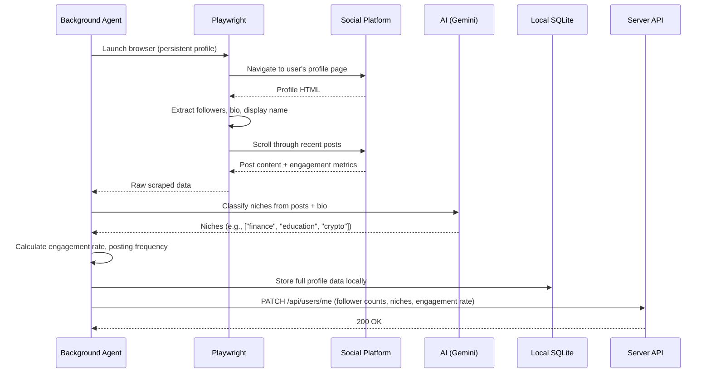
```mermaid
sequenceDiagram
    participant Agent as Background Agent
    participant PW as Playwright
    participant Platform as Social Platform
    participant AI as AI (Gemini)
    participant DB as Local SQLite
    participant S as Server API

    Agent->>PW: Launch browser (persistent profile)
    PW->>Platform: Navigate to user's profile page
    Platform-->>PW: Profile HTML

    PW->>PW: Extract followers, bio, display name
    PW->>Platform: Scroll through recent posts
    Platform-->>PW: Post content + engagement metrics

    PW-->>Agent: Raw scraped data

    Agent->>AI: Classify niches from posts + bio
    AI-->>Agent: Niches (e.g., ["finance", "education", "crypto"])

    Agent->>Agent: Calculate engagement rate, posting frequency

    Agent->>DB: Store full profile data locally
    Agent->>S: PATCH /api/users/me (follower counts, niches, engagement rate)
    S-->>Agent: 200 OK
```

### Error Cases

| Error | Handling |
|-------|----------|
| Session expired during scraping | Skip platform. Alert user to re-authenticate. Use last known data for matching. |
| Profile page layout changed | Scraper fails gracefully. Log error. Use last known data. Flag for developer attention. |
| AI niche classification fails | Keep previously detected niches. Retry on next weekly scrape. |
| User has very few posts (<5) | Use bio text only for niche detection. Engagement rate marked as "insufficient data." |
| Server unreachable during sync | Store locally. Retry on next poll cycle. |

---

## Flow 11: Session Health

The background agent continuously monitors the health of each connected platform's browser session so that posting failures due to expired sessions are minimized.

### Health Statuses

| Status | Meaning | Visual | Action |
|--------|---------|--------|--------|
| **Green** | Session valid, posting works | Green dot | None needed |
| **Yellow** | Session may be expiring soon (cookies nearing expiry) | Yellow dot | Alert: "Session for {platform} may expire soon. Consider re-authenticating." |
| **Red** | Session expired, posting will fail | Red dot | Alert: "Your {platform} session has expired. Click to re-authenticate." |

### Check Mechanism

| Step | Action | Component |
|------|--------|-----------|
| 1 | Background agent runs session check periodically (e.g., every 2 hours) | Background Agent |
| 2 | For each connected platform, launch lightweight Playwright check | Playwright |
| 3 | Navigate to a simple authenticated page (e.g., profile settings) | Playwright |
| 4 | If page loads with authenticated content: Green. If redirect to login: Red. If partial/slow: Yellow. | Background Agent |
| 5 | Update platform health status in local DB and UI | Local SQLite + UI |

### Interaction with Posting

When a post fails due to a session issue:

1. Post is marked `failed` with reason `session_expired`
2. User gets an immediate desktop notification
3. The specific platform status turns Red in the dashboard
4. Other platforms are NOT affected -- a Red X session does not block LinkedIn/Facebook/Reddit posts
5. Campaigns are NOT paused or blocked
6. The failed platform's post is queued for automatic retry once the user re-authenticates
7. User re-authenticates by clicking the Red status indicator, which opens the platform login browser

### Sequence Diagram

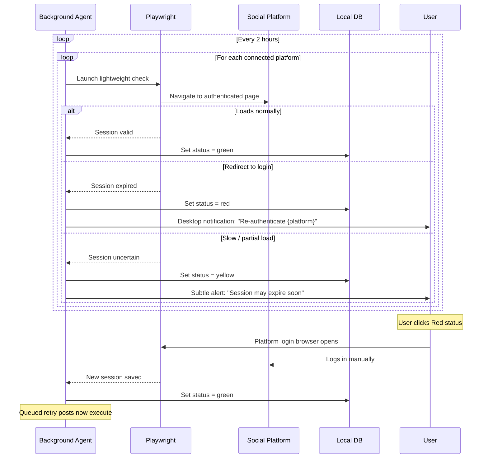
```mermaid
sequenceDiagram
    participant Agent as Background Agent
    participant PW as Playwright
    participant Platform as Social Platform
    participant DB as Local DB
    participant U as User

    loop Every 2 hours
        loop For each connected platform
            Agent->>PW: Launch lightweight check
            PW->>Platform: Navigate to authenticated page

            alt Loads normally
                PW-->>Agent: Session valid
                Agent->>DB: Set status = green
            else Redirect to login
                PW-->>Agent: Session expired
                Agent->>DB: Set status = red
                Agent->>U: Desktop notification: "Re-authenticate {platform}"
            else Slow / partial load
                PW-->>Agent: Session uncertain
                Agent->>DB: Set status = yellow
                Agent->>U: Subtle alert: "Session may expire soon"
            end
        end
    end

    Note over U: User clicks Red status
    U->>PW: Platform login browser opens
    U->>Platform: Logs in manually
    PW-->>Agent: New session saved
    Agent->>DB: Set status = green

    Note over Agent: Queued retry posts now execute
```

### Error Cases

| Error | Handling |
|-------|----------|
| Health check itself fails (network error) | Treat as Yellow. Retry sooner (30 min). |
| User ignores Red status for days | Campaigns continue on other platforms. Periodic re-alerts (daily). Posts for Red platform stay in Failed. |
| Re-authentication fails (platform 2FA changed, account locked) | Remain Red. User must resolve with the platform directly. |
| Multiple platforms go Red simultaneously | Each shown independently. User can re-authenticate one at a time. |

---

## Flow 12: Prohibited Content Screening

Automated screening that prevents harmful campaigns from reaching users. Runs when a campaign is activated.

### Prohibited Categories

- Adult / sexually explicit content
- Gambling
- Drugs / controlled substances
- Weapons
- Financial fraud / scams / get-rich-quick schemes
- Hate speech / discrimination

### Steps

| Step | Action | Component | Details |
|------|--------|-----------|---------|
| 1 | **Company activates campaign** | Company Dashboard | Campaign status transition: draft -> active requested. |
| 2 | **Automated keyword screening** | Server | Campaign title, brief, content guidance, and assets scanned against keyword blocklist and pattern rules. |
| 3a | **Clean: Activate immediately** | Server | No prohibited content detected. Campaign goes active. Matching runs. Invitations sent. |
| 3b | **Flagged: Requires admin review** | Server | Suspicious content detected. Campaign saved with status `flagged`. Company notified: "Your campaign is under review." |
| 4 | **Admin reviews flagged campaign** | Admin Dashboard (Campaign Review Queue) | Admin sees: campaign details, flagged keywords/phrases (highlighted), flag reason. |
| 5a | **Admin approves** | Admin Dashboard -> Server | Campaign activated. Matching runs. Invitations sent. Company notified: "Campaign approved." |
| 5b | **Admin rejects** | Admin Dashboard -> Server | Campaign status set to `rejected`. Company notified with reason: "Campaign rejected: {reason}." Company can edit and resubmit. |

### Sequence Diagram

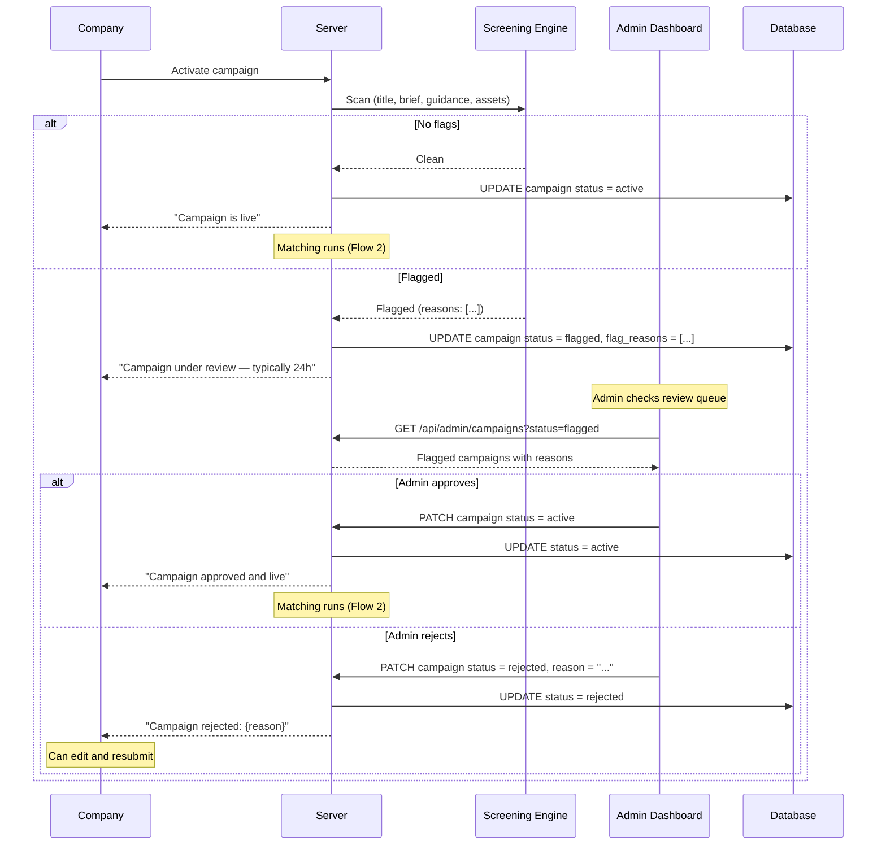
```mermaid
sequenceDiagram
    participant Co as Company
    participant S as Server
    participant Screen as Screening Engine
    participant Admin as Admin Dashboard
    participant DB as Database

    Co->>S: Activate campaign
    S->>Screen: Scan (title, brief, guidance, assets)

    alt No flags
        Screen-->>S: Clean
        S->>DB: UPDATE campaign status = active
        S-->>Co: "Campaign is live"
        Note over S: Matching runs (Flow 2)
    else Flagged
        Screen-->>S: Flagged (reasons: [...])
        S->>DB: UPDATE campaign status = flagged, flag_reasons = [...]
        S-->>Co: "Campaign under review — typically 24h"

        Note over Admin: Admin checks review queue
        Admin->>S: GET /api/admin/campaigns?status=flagged
        S-->>Admin: Flagged campaigns with reasons

        alt Admin approves
            Admin->>S: PATCH campaign status = active
            S->>DB: UPDATE status = active
            S-->>Co: "Campaign approved and live"
            Note over S: Matching runs (Flow 2)
        else Admin rejects
            Admin->>S: PATCH campaign status = rejected, reason = "..."
            S->>DB: UPDATE status = rejected
            S-->>Co: "Campaign rejected: {reason}"
            Note over Co: Can edit and resubmit
        end
    end
```

### Error Cases

| Error | Handling |
|-------|----------|
| Screening engine unavailable | Campaign queued for screening. Company sees "Activation pending." Retried in background. |
| False positive (legitimate campaign flagged) | Admin approves after review. No delay beyond review time. |
| False negative (prohibited content passes) | Admin can manually flag active campaigns. Campaign paused and sent to review queue. Existing posts are not recalled (handled in future version). |
| Company resubmits rejected campaign without changes | Re-screened. If still flagged, back to review queue. |

---

## Flow 13: Admin Workflow

The admin dashboard provides oversight of the entire marketplace. It is a web app at `/admin/` with password-based authentication.

### Authentication

- Route: `/admin/login`
- Method: Password-based (configured via `ADMIN_PASSWORD` env var)
- Session: Cookie-based (`admin_token`)

### Admin Tasks

#### 1. Review Flagged Campaigns

| Step | Action | Details |
|------|--------|---------|
| 1 | Navigate to Campaign Review Queue | Shows all campaigns with status `flagged` |
| 2 | Review campaign details | Title, brief, content guidance, flagged keywords (highlighted), flag reasons |
| 3 | Approve or Reject | Approve: campaign activates, matching runs. Reject: company notified with reason. |

#### 2. Monitor Users and Trust Scores

| Step | Action | Details |
|------|--------|---------|
| 1 | Navigate to Users page | List of all users with: trust score, operating mode, platform count, total earned, status |
| 2 | Filter by status | Active, suspended, low trust (< 50) |
| 3 | Suspend or unsuspend users | Suspended users receive no new campaign invitations. Existing campaigns can complete. |

Trust score events and their impact:

| Event | Score Change |
|-------|-------------|
| Post verified live at 24h | +1 |
| Above-average engagement | +2 |
| Campaign completed | +3 |
| Post deleted within 24h | -10 |
| Content flagged | -15 |
| Metrics anomaly detected | -20 |
| Confirmed fake metrics | -50 |

#### 3. Run Fraud Detection

| Step | Action | Details |
|------|--------|---------|
| 1 | Navigate to Fraud Detection page | Shows recent penalties and detection results |
| 2 | Click "Run Check" | Triggers deletion fraud detection (posts marked live but actually deleted) and metrics anomaly detection (engagement >3x platform average for follower count) |
| 3 | Review results | List of flagged users with: user ID, reason, severity, evidence |
| 4 | Apply penalties or dismiss | Penalties deduct trust score. Severe cases: suspend user. |

#### 4. Run Billing and Payout Cycles

| Step | Action | Details |
|------|--------|---------|
| 1 | Navigate to Payouts page | Shows total pending, paid, and failed amounts |
| 2 | Click "Run Billing" | Processes all posts with final metrics into payout records |
| 3 | Review billing results | Posts processed, total earned, total deducted from budgets |
| 4 | Click "Run Payout" | Transfers earned amounts to users via Stripe Connect (skeleton for now) |
| 5 | Monitor payout status | Pending, processing, paid, failed per user |

#### 5. View Platform Stats

| Metric | Description |
|--------|-------------|
| Total posts per platform | How many posts published on X, LinkedIn, Facebook, Reddit |
| Success rate per platform | Posts succeeded / posts attempted |
| Average engagement per platform | Mean impressions, likes, reposts per post |
| Total users | Active, suspended, total |
| Total campaigns | Active, completed, cancelled |
| Platform revenue | Total 20% cut from all billing |

### Admin Dashboard Navigation

```
/admin/login     -> Password authentication
/admin/          -> Overview (system-wide stats, recent activity)
/admin/users     -> User management (list, filter, suspend/unsuspend)
/admin/campaigns -> Campaign overview (all companies, all statuses)
/admin/fraud     -> Fraud detection (run checks, review penalties)
/admin/payouts   -> Billing + payouts (run cycles, monitor status)
```

---

## Appendix A: Data Sync Model

The user app and server maintain separate databases. Data flows in defined directions with deduplication guarantees.

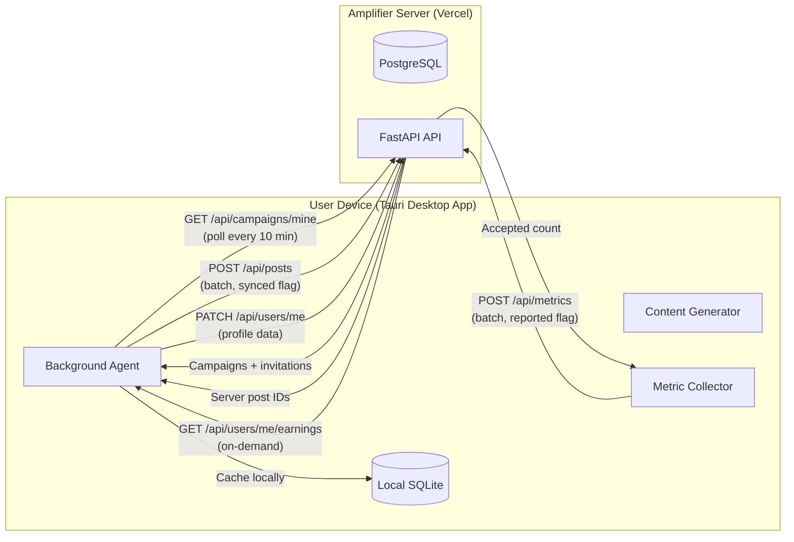
```mermaid
flowchart LR
    subgraph UserDevice["User Device (Tauri Desktop App)"]
        LocalDB[(Local SQLite)]
        Agent[Background Agent]
        CG[Content Generator]
        MC[Metric Collector]
    end

    subgraph Server["Amplifier Server (Vercel)"]
        ServerDB[(PostgreSQL)]
        API[FastAPI API]
    end

    Agent -->|"GET /api/campaigns/mine<br/>(poll every 10 min)"| API
    API -->|"Campaigns + invitations"| Agent
    Agent -->|"Cache locally"| LocalDB

    Agent -->|"POST /api/posts<br/>(batch, synced flag)"| API
    API -->|"Server post IDs"| Agent

    MC -->|"POST /api/metrics<br/>(batch, reported flag)"| API
    API -->|"Accepted count"| MC

    Agent -->|"PATCH /api/users/me<br/>(profile data)"| API

    API -->|"GET /api/users/me/earnings<br/>(on-demand)"| Agent
```

### Sync Guarantees

| Entity | Direction | Dedup Mechanism | Offline Behavior |
|--------|-----------|-----------------|------------------|
| Campaigns | Server -> Client | `upsert_campaign()` on server_id | Cached locally after first poll |
| Posts | Client -> Server | `synced` flag (0=pending, 1=synced) | Queued locally, synced when online |
| Metrics | Client -> Server | `reported` flag + server_post_id required | Stored locally, batched for sync |
| Earnings | Server -> Client | Server authoritative, local table is cache | Stale until next poll |
| Profile | Client -> Server | Overwrites on each sync | Local data always fresh |

---

## Appendix B: Complete Post Status Lifecycle

A single campaign post goes through these states from creation to payout:

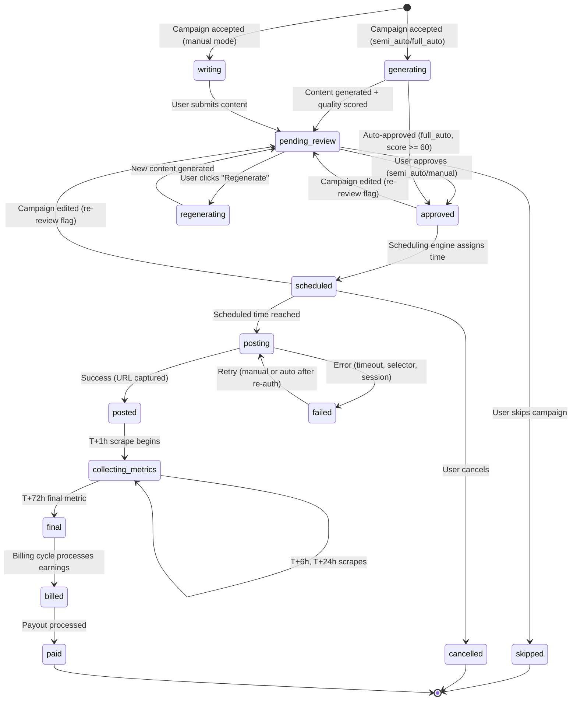
```mermaid
stateDiagram-v2
    [*] --> generating : Campaign accepted (semi_auto/full_auto)
    [*] --> writing : Campaign accepted (manual mode)

    generating --> pending_review : Content generated + quality scored
    writing --> pending_review : User submits content

    pending_review --> approved : User approves (semi_auto/manual)
    generating --> approved : Auto-approved (full_auto, score >= 60)
    pending_review --> regenerating : User clicks "Regenerate"
    regenerating --> pending_review : New content generated

    pending_review --> skipped : User skips campaign

    approved --> scheduled : Scheduling engine assigns time
    approved --> pending_review : Campaign edited (re-review flag)

    scheduled --> posting : Scheduled time reached
    scheduled --> pending_review : Campaign edited (re-review flag)
    scheduled --> cancelled : User cancels

    posting --> posted : Success (URL captured)
    posting --> failed : Error (timeout, selector, session)

    failed --> posting : Retry (manual or auto after re-auth)

    posted --> collecting_metrics : T+1h scrape begins
    collecting_metrics --> collecting_metrics : T+6h, T+24h scrapes
    collecting_metrics --> final : T+72h final metric

    final --> billed : Billing cycle processes earnings
    billed --> paid : Payout processed

    skipped --> [*]
    cancelled --> [*]
    paid --> [*]
```

---

## Appendix C: Campaign Assignment Status Lifecycle

Each user-campaign relationship (assignment) has its own status:

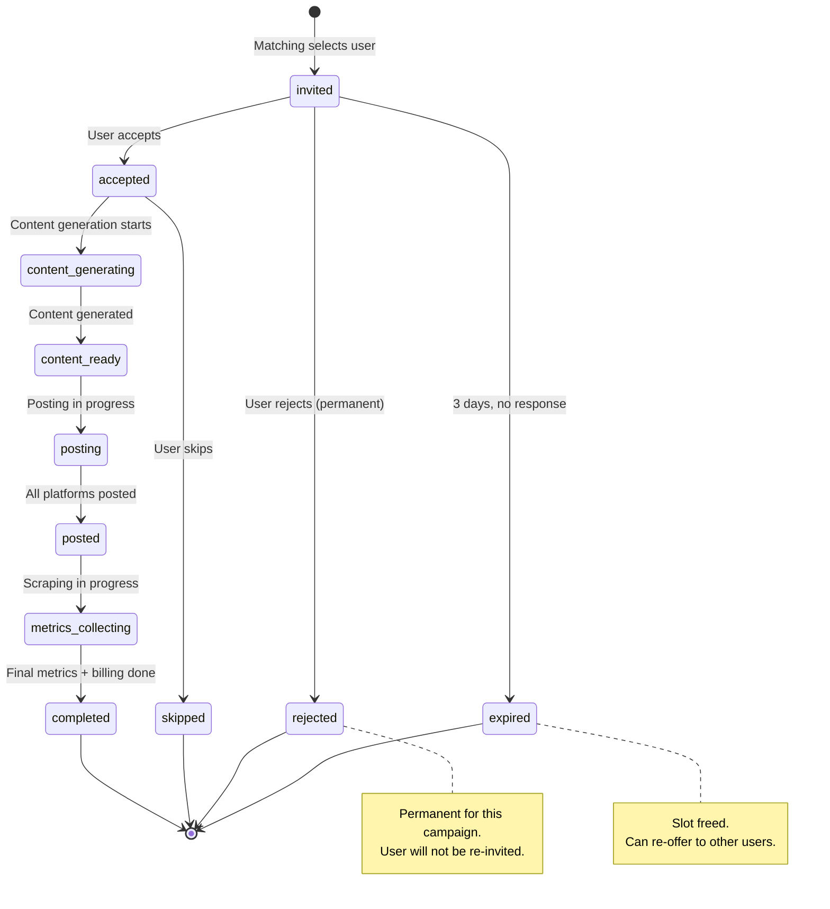
```mermaid
stateDiagram-v2
    [*] --> invited : Matching selects user
    invited --> accepted : User accepts
    invited --> rejected : User rejects (permanent)
    invited --> expired : 3 days, no response

    accepted --> content_generating : Content generation starts
    content_generating --> content_ready : Content generated
    content_ready --> posting : Posting in progress
    posting --> posted : All platforms posted
    posted --> metrics_collecting : Scraping in progress
    metrics_collecting --> completed : Final metrics + billing done

    accepted --> skipped : User skips
    expired --> [*]
    rejected --> [*]
    skipped --> [*]
    completed --> [*]

    note right of expired
        Slot freed.
        Can re-offer to other users.
    end note

    note right of rejected
        Permanent for this campaign.
        User will not be re-invited.
    end note
```
