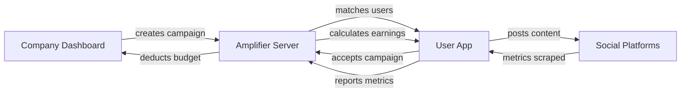
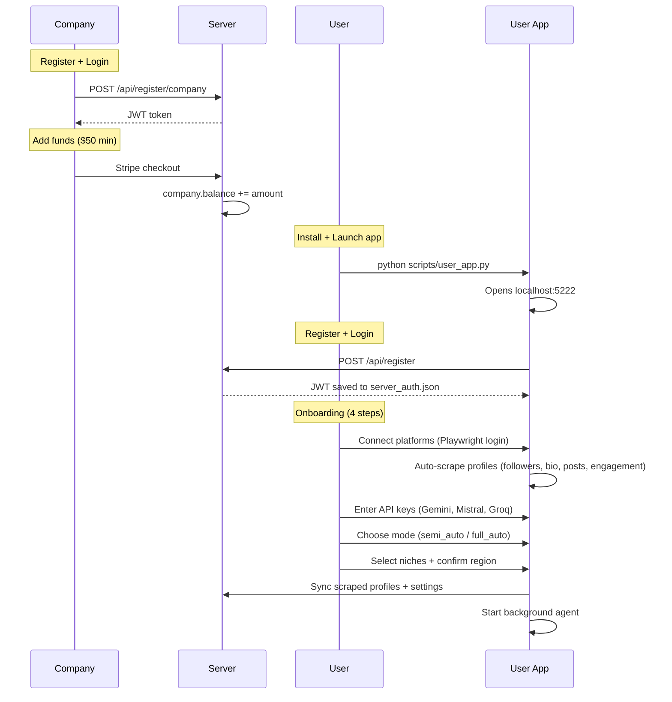
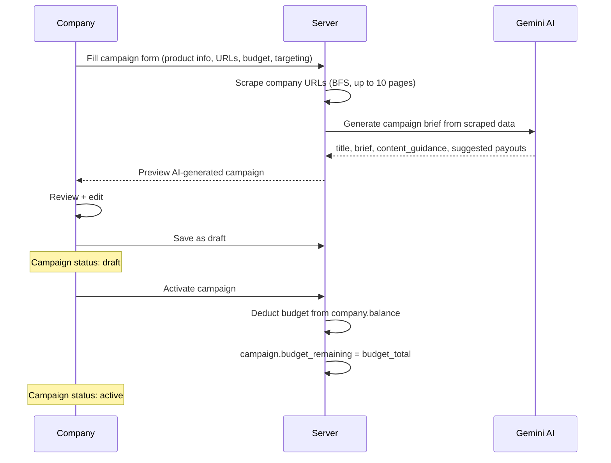
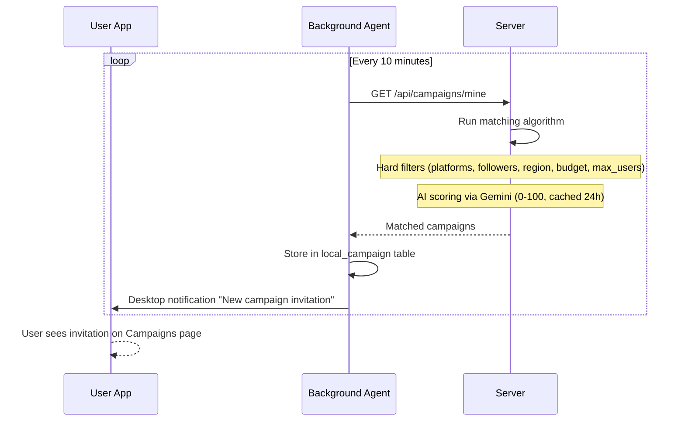
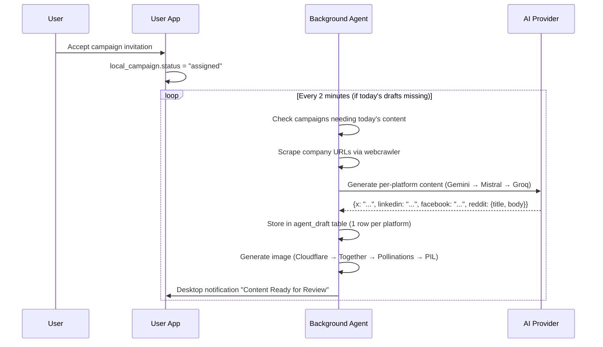
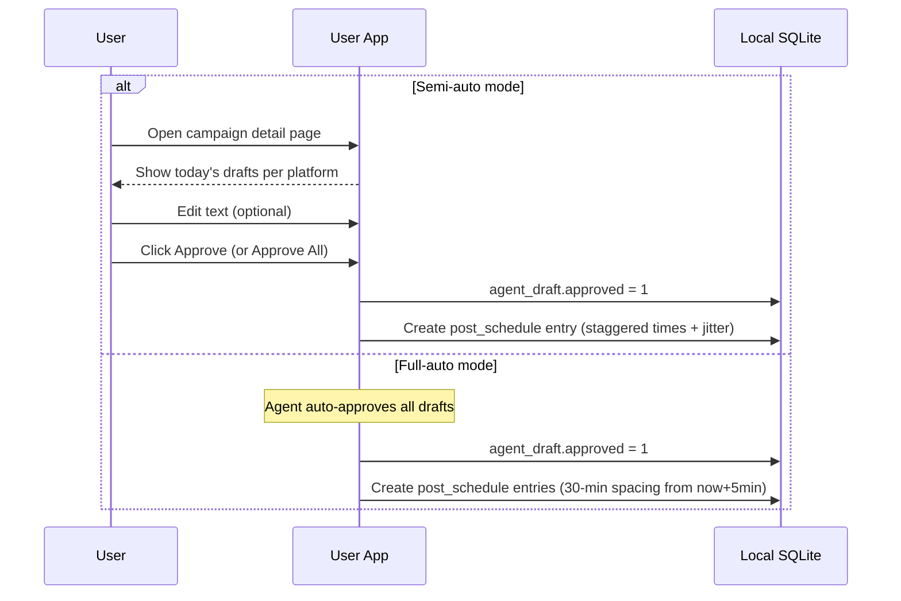
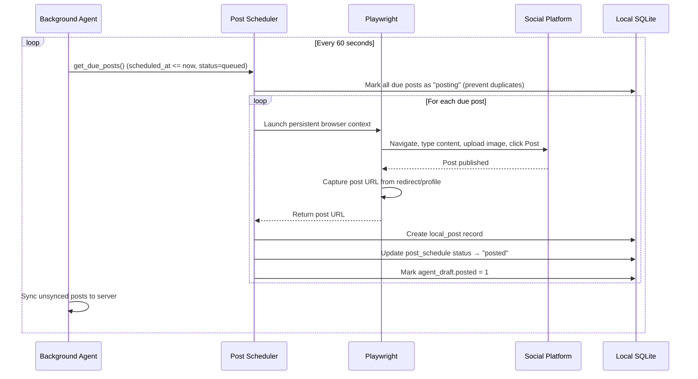
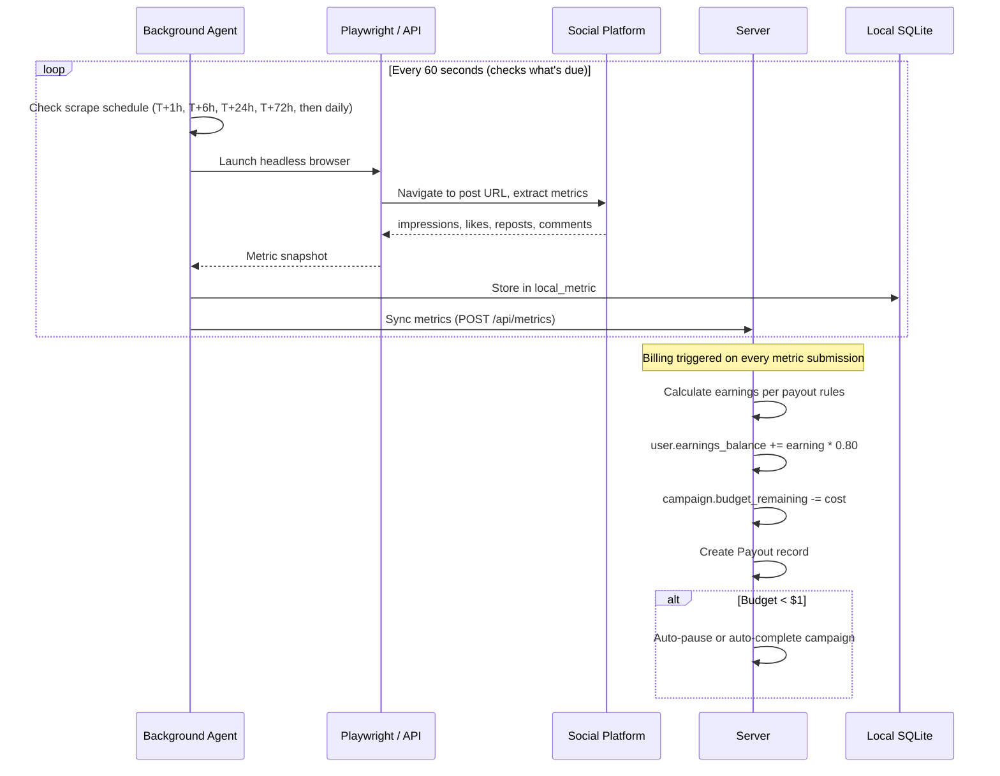
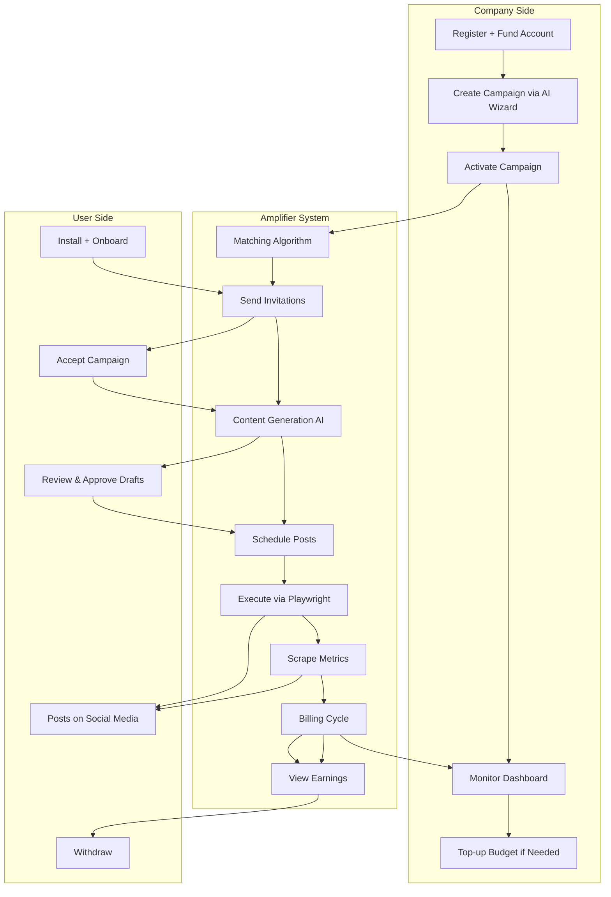

# Amplifier — System Flow

Three actors: **Company** (web dashboard), **Amplifier** (server + background agent), **User** (desktop app).

---

## Overview



---

## Phase 1: Setup



### Company Setup
| Step | Action | Result |
|------|--------|--------|
| 1 | Register (email + password) | Company account created, balance = $0 |
| 2 | Add funds via Stripe | balance += amount (min $50 to create campaigns) |

### User Setup
| Step | Action | Result |
|------|--------|--------|
| 1 | Install + launch app | Flask on localhost:5222, system tray icon |
| 2 | Register/login | JWT saved locally |
| 3 | Connect platforms | Playwright opens browser, user logs in manually, profile auto-scraped |
| 4 | Enter API keys | Gemini/Mistral/Groq keys tested + saved locally |
| 5 | Choose mode | semi_auto (review before posting) or full_auto (auto-post) |
| 6 | Select niches | Used for campaign matching |
| 7 | Done | Background agent starts, profiles synced to server |

---

## Phase 2: Campaign Creation



### Campaign Fields
| Field | Required | Notes |
|-------|----------|-------|
| Product name + description | Yes | What the product is |
| Product features | Yes | Why it's worth posting about |
| Public URLs | Yes | Scraped by AI for context |
| Campaign goal | Yes | brand awareness / leads / sales / app installs |
| Budget | Yes | Min $50, deducted on activation |
| Payout rates | Yes | Per 1K impressions, per like, per repost, per click |
| Targeting | No | Min followers, niches, regions, required platforms |
| Max users | Yes | Cap on how many users can accept |
| Start/end date | Yes | Campaign duration |

---

## Phase 3: Matching



### Matching Pipeline (Server-side)

Matching depends entirely on the **scraped profile data** synced during onboarding (Phase 1). When the user connects platforms, Amplifier auto-scrapes their followers, bio, recent posts, engagement rate, and niche — then syncs everything to the server. This scraped data is what the matching algorithm uses for both hard filters and AI scoring.

```
Active campaigns
    |
    v
Hard Filters (pass/fail) — uses scraped profile data:
    - User has required platforms connected (from scraped_profile.platform)
    - User meets min follower counts (from scraped_profile.follower_count)
    - User's region matches target regions (from settings.audience_region)
    - User meets min engagement rate (from scraped_profile.engagement_rate)
    - Campaign has budget remaining
    - accepted_count < max_users
    - User has < 3 active campaigns
    |
    v
AI Scoring (Gemini) — uses full scraped profile:
    - Reads bio, recent posts with engagement, follower/following counts,
      LinkedIn work experience, Reddit post history — all from scraped data
    - Scores 0-100 on topic relevance, audience fit, authenticity
    - Low followers NOT penalized (normal people platform)
    - Cached 24h per (campaign, user)
    |
    v
Sort by score → Create CampaignAssignment (pending_invitation, 3-day TTL)
```

---

## Phase 4: Content Generation



### AI Provider Fallback Chain
```
Text: Gemini 2.5 Flash → Gemini 2.0 Flash → Mistral Small → Groq Llama 3.3 70B
Image: Cloudflare FLUX.1 → Together FLUX.1 → Pollinations → PIL branded template
```

### Content Generation Details
| Step | What happens |
|------|-------------|
| Research | Scrape company URLs, extract product info |
| Prompt | Campaign brief + research + previous posts (anti-repetition) + must-include/avoid |
| Output | Platform-native text per platform (different tone/length/format) |
| Style | UGC — sounds like a real person recommending, not an ad |
| Storage | `agent_draft` table, 1 row per (campaign, platform, day) |

---

## Phase 5: Review & Approval



### Draft Status Lifecycle
```
Generated (approved=0) → Approved (approved=1) → Posted (posted=1)
                       → Rejected (approved=-1) → Restored (approved=0)
```

### Scheduling Logic
- Base time: max(now + 5min, last_queued + 30min)
- Jitter: + random 0-10 minutes
- Peak windows considered: X (8-10, 12-13, 17-19), LinkedIn (8-10, 12-13), Facebook (12-14, 19-21), Reddit (8-11, 18-21)
- All times in target region's timezone

---

## Phase 6: Posting



### Platform-Specific Posting
| Platform | Method | URL Capture |
|----------|--------|-------------|
| X | `data-testid="fileInput"` for images, `Ctrl+Enter` to submit | Profile refresh → latest tweet URL |
| LinkedIn | Clipboard paste for images, shadow DOM text editor | Success dialog "View post" link |
| Facebook | Clipboard paste for images, keyboard.type for text | Profile URL fallback (React UI) |
| Reddit | "Upload files" button + file chooser, JS focus for Lexical editor | Redirect `?created=t3_XXX` → construct permalink |

### Post Types Supported
- Text-only (all platforms)
- Image + text (all platforms)
- Image-only (all platforms)

---

## Phase 7: Metrics & Billing



### Billing Formula
```
raw_earning = (impressions/1000 * rate_per_1k_impressions)
            + (likes * rate_per_like)
            + (reposts * rate_per_repost)
            + (clicks * rate_per_click)

user_earning = raw_earning * 0.80    (Amplifier takes 20%)
company_cost = raw_earning           (full amount from budget)
```

### Scrape Schedule
| Tier | When | Purpose |
|------|------|---------|
| 1 | T + 1 hour | Verify post is live |
| 2 | T + 6 hours | Early engagement |
| 3 | T + 24 hours | Primary metric |
| 4 | T + 72 hours | Settled engagement |
| 5+ | Every 24 hours | Ongoing (while campaign active) |

---

## Phase 8: Monitoring & Earnings

### Company Dashboard
```
GET /company/campaigns/{id}
    |
    ├── Stats cards: posts, creators, impressions, engagement, budget spent/remaining
    ├── Per-platform breakdown: CPM, CPE, spend per platform
    ├── Creator table: each user's posts, metrics, earnings
    ├── Invitation funnel: sent → accepted → rejected → expired
    └── Budget management: top-up, 80% alert, exhaustion handling
```

### User Dashboard
```
GET /earnings
    |
    ├── Total earned, available balance, pending
    ├── Per-campaign breakdown
    ├── Per-platform breakdown
    ├── Payout history
    └── Withdraw ($10 minimum)
```

---

## Complete Lifecycle — One Diagram



---

## Data Stores

| Store | Location | What it holds |
|-------|----------|--------------|
| Server DB (Supabase PostgreSQL) | Vercel | Companies, Campaigns, Users, Assignments, Posts, Metrics, Payouts |
| Local SQLite (`data/local.db`) | User's machine | local_campaign, agent_draft, post_schedule, local_post, local_metric, settings, scraped_profile |
| Browser Profiles (`profiles/`) | User's machine | Persistent Playwright contexts per platform (logged-in sessions) |
| Server Auth (`config/server_auth.json`) | User's machine | JWT token for server communication |
| Platform Config (`config/platforms.json`) | User's machine | Enable/disable platforms, URLs, subreddits |

---

## Key Files

| Component | File | Role |
|-----------|------|------|
| User App | `scripts/user_app.py` | Flask web server (port 5222), all routes |
| Background Agent | `scripts/background_agent.py` | Daemon thread: polling, content gen, posting, scraping |
| Post Scheduler | `scripts/utils/post_scheduler.py` | Scheduling logic + execution bridge to post.py |
| Posting Engine | `scripts/post.py` | Playwright automation per platform |
| Content Generator | `scripts/utils/content_generator.py` | AI text + image generation |
| Metric Scraper | `scripts/utils/metric_scraper.py` | Post engagement collection |
| Profile Scraper | `scripts/utils/profile_scraper.py` | User profile data extraction |
| Local Database | `scripts/utils/local_db.py` | All SQLite operations |
| Server Client | `scripts/utils/server_client.py` | HTTP client for remote server |
| System Tray | `scripts/utils/tray.py` | Windows tray icon + notifications |
| Server | `server/app/main.py` | FastAPI server (52 routes) |
| Matching | `server/app/services/matching.py` | Campaign-to-user matching |
| Billing | `server/app/services/billing.py` | Earnings calculation |
| Campaign Wizard | `server/app/services/campaign_wizard.py` | AI campaign brief generation |
