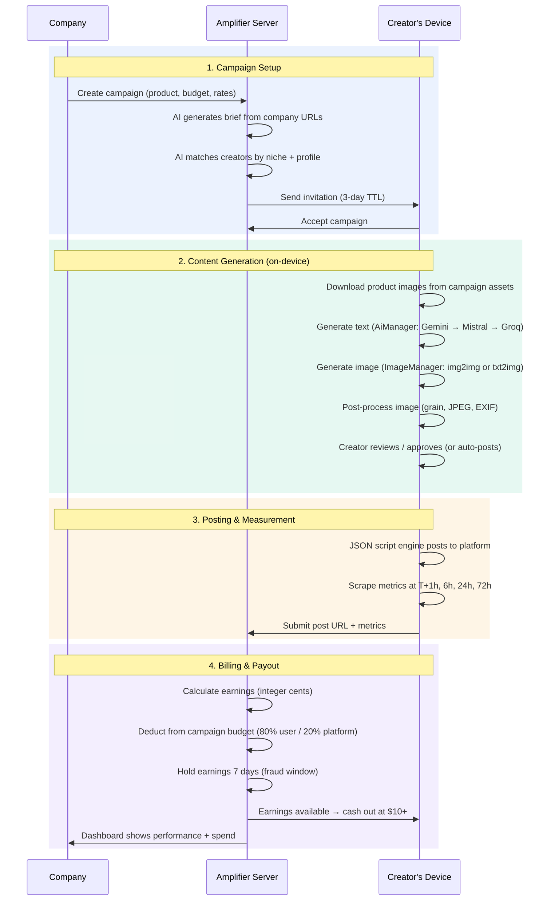
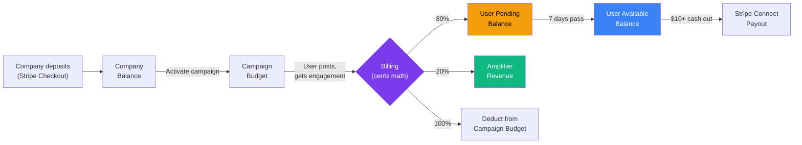

# Amplifier — Product Concept

## The One-Line Version

Amplifier is a marketplace where companies pay everyday people to post about their products on social media — and AI handles everything from content creation to posting to payment.

---

## The Problem

### Companies Can't Afford Social Media Marketing

Social media marketing is broken for most companies.

Hiring an influencer costs $500-$50,000 per post. Running ads means competing in auctions against companies with 100x your budget. Going "organic" means shouting into the void and hoping someone listens.

The result: small and mid-size companies — the ones who actually need social media marketing — can't afford it. The companies that can afford it are fighting over the same small pool of influencers, driving prices higher every year.

And here's the kicker: when you do pay for an influencer post, you're paying upfront with no performance guarantee. You send $2,000 to someone with 50K followers, they post a story that disappears in 24 hours, and you have no idea if it moved the needle.

### People Can't Monetize Their Social Media

On the other side, billions of people spend hours every day on social media and earn nothing from it.

Platform monetization has impossibly high bars. YouTube requires 1,000 subscribers and 4,000 watch hours. TikTok's Creator Fund needs 10,000 followers. Instagram's bonuses are invite-only. For the vast majority of people — the ones with 200 followers on X, 500 connections on LinkedIn, 300 friends on Facebook — there's simply no way to earn money from the time they spend online.

Affiliate marketing exists, but it's saturated and obvious. Every post looks like an ad. People tune it out.

### The Gap Nobody's Filling

There are roughly 5 billion social media users worldwide. Fewer than 1% are "creators" or "influencers." The other 99% — normal people with real social networks — represent a massive, untapped distribution channel.

If you could coordinate thousands of normal people to post authentic content about products they'd actually use, you'd unlock:

- **Massive reach at low cost.** 1,000 people with 500 followers each = 500,000 potential impressions.
- **Authentic distribution.** Real people posting on their real profiles to people who actually know them. No "ad" label. No algorithm penalty.
- **Performance alignment.** Pay only for engagement that actually happens — not for the privilege of being posted about.

That's what Amplifier does.

---

## How Amplifier Works

### The End-to-End Flow

### For Companies

1. **Create a campaign.** Describe your product, paste your website URL. Amplifier's AI scrapes your site and generates a complete campaign brief — what to say, how to say it, who should say it. Upload product photos for AI image generation.

2. **Set your budget and rates.** Decide how much you'll pay per 1,000 impressions, per like, per share, per click. Set a total budget. Amplifier suggests rates based on your niche (finance/tech pays more, lifestyle less).

3. **Go live.** That's it. AI automatically matches your campaign to relevant users based on their social media profiles, niches, audience, and posting history. Users start posting within 24 hours. You pay only for real engagement.

4. **Track everything.** See exactly which users are posting, what they posted, how each post performed, and what you're paying. Export reports. Adjust budget. Pause or resume anytime.

**Time from signup to live campaign: under 10 minutes.**

### For Users (Amplifiers)

1. **Install the app.** Desktop app for Windows. Connect your social media accounts (X, LinkedIn, Facebook, Reddit). The app never sees your passwords — it uses persistent browser sessions.

2. **Accept campaigns.** AI matches you with campaigns that fit your niche and audience. You see the campaign brief, payout rates, and what's expected. Accept up to 3 campaigns at first (more as your reputation grows).

3. **Review or auto-post.** AI generates platform-native content for each of your connected platforms — text captions AND images. It can transform the company's product photos into authentic lifestyle scenes (img2img), or generate images from text descriptions (txt2img). In semi-auto mode, you review and approve. In full-auto mode (unlocked at Grower tier), it posts automatically.

4. **Earn money.** The app tracks your posts' engagement (impressions, likes, shares) and reports it to the server. Earnings are held for 7 days (fraud prevention), then become available. Cash out when you hit $10.

**Time from install to first earning: same day.**

---

## Three Content Generation Modes

| Mode | Input | Output | When Used |
|---|---|---|---|
| **Text → Text** | Campaign brief + guidance | Platform-native captions (different tone per platform) | Every campaign |
| **Text → Image** | AI-generated image prompt | Lifestyle photo with UGC post-processing (grain, JPEG artifacts, phone EXIF) | Campaigns without product photos |
| **Image → Image** | Company's product photo | UGC-style scene featuring the real product | Campaigns with product photos in assets |

Images rotate daily through multiple campaign photos (Day 1 uses photo A, Day 2 uses photo B, wraps around). Every generated image passes through a UGC authenticity pipeline — desaturation, film grain, vignetting, JPEG compression, fake phone EXIF data — so it looks like a real person took it with their phone, not like AI generated it.

---

## What Makes Amplifier Different

### vs. Influencer Marketing Agencies

| | Influencer Agencies | Amplifier |
|---|---|---|
| **Cost** | $500-$50K per post | Pay per engagement (often $5-$50 per user per campaign) |
| **Payment model** | Pay upfront, hope for results | Pay only for real engagement |
| **Reach** | Concentrated in few influencers | Distributed across thousands of normal people |
| **Content** | Created by influencer (variable) | AI-generated, platform-native, brand-guided |
| **Images** | Influencer takes their own photos | AI generates UGC-style images from product photos |
| **Setup time** | Weeks of negotiation | Minutes |
| **Tracking** | Manual, screenshots | Automated metric scraping + billing |

### vs. Affiliate Marketing (ShareASale, Impact, etc.)

Affiliate networks pay for conversions (clicks, signups, purchases). Amplifier pays for engagement (impressions, likes, shares). This matters because:
- Affiliate links are obvious and people avoid them
- Affiliate requires the user to manually craft promotional content
- Amplifier content looks like normal social media posts because it is — AI generates authentic UGC, not ads

### vs. Social Media Management Tools (Hootsuite, Buffer, etc.)

These tools help you manage your own accounts. Amplifier manages other people posting about you. Completely different value proposition — Amplifier is a distribution channel, not a scheduling tool.

### vs. UGC Platforms (Billo, JoinBrands, etc.)

UGC platforms connect brands with creators who make content. But the brand still has to distribute that content themselves. Amplifier generates AND distributes — content is posted directly to users' real social accounts, reaching their real audiences.

---

## The Business Model

### Revenue

Amplifier takes a **20% cut** of all earnings.

When a company pays $1.00 for engagement on a user's post:
- **$0.80** goes to the user
- **$0.20** goes to Amplifier

No subscription fees. No setup costs. Pure marketplace economics.

### Reputation Tiers

Users progress through three tiers as they build a track record:

| Tier | Unlock | Max Campaigns | CPM Rate | Auto-Post |
|---|---|---|---|---|
| **Seedling** | Default (new user) | 3 | 1x standard | Requires approval |
| **Grower** | 20 successful posts | 10 | 1x standard | Toggle available |
| **Amplifier** | 100 posts + high trust | Unlimited | **2x premium** | Full auto |

Higher tiers = more campaigns, more earnings per impression, less manual review. This incentivizes consistent, quality posting.

### Financial Safety

- **7-day earning hold**: Earnings are "pending" for 7 days before becoming withdrawable. If fraud is detected during the hold period (deleted posts, fake metrics), earnings are voided and funds return to the campaign budget.
- **Integer cents math**: All money is stored as integer cents internally (not floats), eliminating rounding errors. Consistent with Stripe's own cent-based API.
- **AES-256-GCM encryption**: API keys, payment details, and sensitive data encrypted at rest on both server and client devices.

### Unit Economics (Projected)

| Metric | Value |
|---|---|
| Average campaign budget | $200-$500 |
| Average payout per user per campaign | $5-$50 |
| Amplifier revenue per campaign | $40-$100 (20% of budget) |
| Cost to serve (AI API calls, hosting) | ~$2-5 per campaign |
| Gross margin | ~90%+ |

The economics work because:
- AI content generation uses free-tier APIs (Gemini 500 images/day free, text gen free)
- Image post-processing runs locally (PIL + numpy)
- Hosting is on Vercel's free/hobby tier
- Database is Supabase's free tier
- All compute-heavy work (browser automation, AI generation, metric scraping) runs on users' devices

### How Money Flows

---

## Market Opportunity

### The Social Media Marketing Market

- Global social media advertising market: **$230+ billion** (2025)
- Influencer marketing market: **$21+ billion** (2025), growing 30%+ annually
- Creator economy: **$100+ billion** (2025)

### Amplifier's Addressable Market

**TAM (Total Addressable Market):** $21B — the global influencer marketing spend.

**SAM (Serviceable Addressable Market):** $5B — small-to-mid US companies spending $500-$50K/year on social media marketing.

**SOM (Serviceable Obtainable Market):** $50M — 10,000 companies x $5,000 avg spend x 20% take rate (3-year target).

### Why Now

1. **AI is finally good enough.** Gemini, GPT-4, Claude can generate genuinely good, platform-native social media content. Image generation creates authentic-looking UGC from text descriptions or product photos.
2. **Social media is saturated.** Organic reach is dying. Companies need new distribution channels.
3. **The gig economy is mainstream.** People are used to earning money from apps (Uber, DoorDash, Fiverr). Earning from social media posts is a natural extension.
4. **Free AI tiers make unit economics viable.** Gemini offers 500 free images/day. Text generation APIs are free-tier. The cost of AI content generation per campaign is near zero.

---

## What's Built

Amplifier is not a pitch deck. It's a working product.

### Shipped (V1)

- **Server** — ~90 API routes across 11 routers, deployed on Vercel with Supabase PostgreSQL. 11 database models.
- **Company Dashboard** — 10 pages: login, dashboard overview, campaign list, AI campaign wizard, campaign detail with analytics, billing with Stripe, influencer performance, stats, settings.
- **Admin Dashboard** — 14 pages: overview, user/company management (detail views, suspend/ban/funds), campaign management, financial (billing cycles, earning promotion, payout processing), fraud detection with appeals, analytics, content review queue, audit log, settings.
- **User App** — Desktop app with 32+ routes. 5-step onboarding, campaign dashboard, content review, post scheduling, earnings tracking, background agent control.
- **AI Matching** — Gemini scores user profiles against campaign briefs (0-100), with hard filters (platforms, followers, region, engagement) and niche-overlap fallback. Tier-based campaign limits.
- **AI Content Generation** — Three modes: text-to-text (platform-native captions), text-to-image (UGC lifestyle photos), image-to-image (transform product photos into lifestyle scenes). 5-provider image chain (Gemini → Cloudflare → Together → Pollinations → PIL). UGC post-processing pipeline. Daily product image rotation.
- **Posting Engine** — JSON script-driven automation with fallback selector chains, per-step human timing, structured error recovery with exponential backoff. 4 platforms (X, LinkedIn, Facebook, Reddit).
- **Metric Scraping** — Tiered schedule (T+1h, T+6h, T+24h, T+72h). Per-platform selectors.
- **Billing** — Integer cents math, incremental billing on metric submission, budget capping, auto-pause on exhaustion, 7-day earning hold, auto tier promotion.
- **Trust & Fraud** — Trust scoring (0-100), deletion detection, metrics anomaly detection, penalty system with appeals, earning void during hold period.
- **Reputation Tiers** — Seedling/Grower/Amplifier with auto-promotion, tier-based CPM multiplier (2x for Amplifier), tier-gated features.
- **Security** — AES-256-GCM encryption on server (ENCRYPTION_KEY) and client (machine-derived key). API keys encrypted at rest.
- **Payments** — Stripe Checkout for company top-ups, Stripe Connect for user payouts (test mode), automated payout processing.

### Live URLs

- Company Dashboard: `https://server-five-omega-23.vercel.app/company/login`
- Admin Dashboard: `https://server-five-omega-23.vercel.app/admin/login`
- API Docs: `https://server-five-omega-23.vercel.app/docs`

---

## Risks and Honest Challenges

### Platform Detection

Social media platforms actively detect and block automation. Amplifier mitigates this with:
- JSON script engine with fallback selector chains (3+ selectors per element)
- Human emulation (character-by-character typing, random delays, feed browsing)
- Persistent browser profiles and stealth browser flags
- **But**: X has already locked one test account during development. This is the #1 technical risk.

**Mitigation path:** Official platform APIs for posting (X API, LinkedIn API). Declarative JSON scripts can be updated without app changes when platform UIs change.

### Chicken-and-Egg Marketplace Problem

Every marketplace faces this: companies won't come without users, users won't come without campaigns.

**Approach:** Start with the personal brand engine (already built) to onboard early users who post their own content. Then introduce campaigns once there's a user base.

### Legal / Compliance

Automated posting on behalf of users may violate some platform ToS. FTC requires disclosure of paid partnerships (#ad, #sponsored).

**Approach:** Content generator needs to auto-append disclosure text. Planned for implementation before launch.

### Revenue Scale

At 20% of micro-transactions, reaching meaningful revenue requires volume. $10M ARR needs ~$50M in total campaign spend flowing through the platform.

**Approach:** Focus on retention and automation. If companies see ROI, they increase budgets and create more campaigns. The flywheel: more users → better matching → better results → more company spend → more users.

---

## Summary

| | |
|---|---|
| **What** | Marketplace connecting companies with everyday social media users for paid, AI-generated posts |
| **How** | AI generates text + images, JSON script engine posts it, metrics are scraped, billing is automatic |
| **Revenue** | 20% of all engagement-based earnings |
| **Stage** | V1 built and deployed, pre-revenue, in verification phase |
| **Market** | $21B influencer marketing market, targeting the long tail |
| **Differentiator** | Performance-based billing + AI-native everything + user-side compute + img2img from product photos |
| **#1 Risk** | Platform automation detection |
| **#1 Opportunity** | First mover in AI-powered micro-influencer marketplace |
