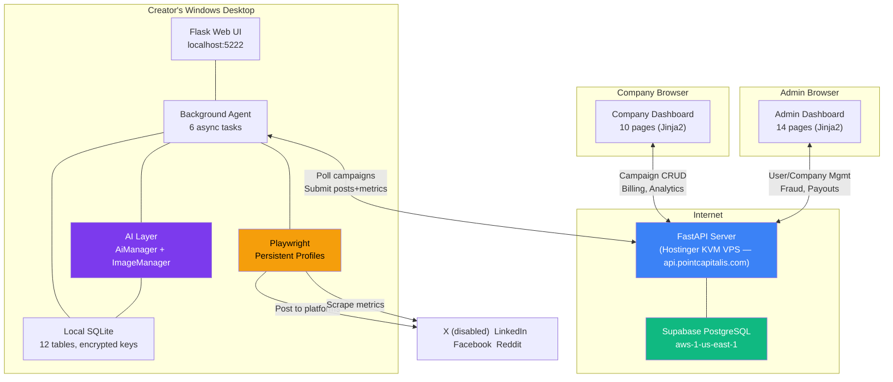
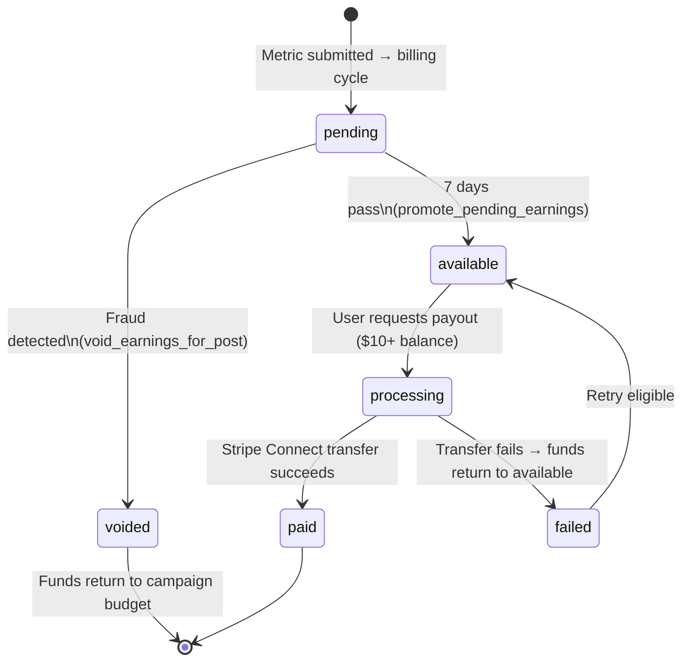
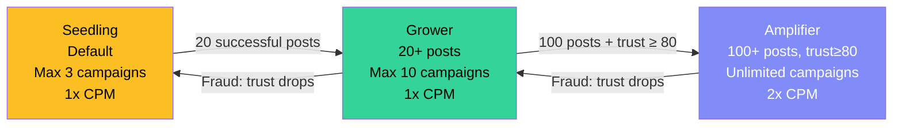
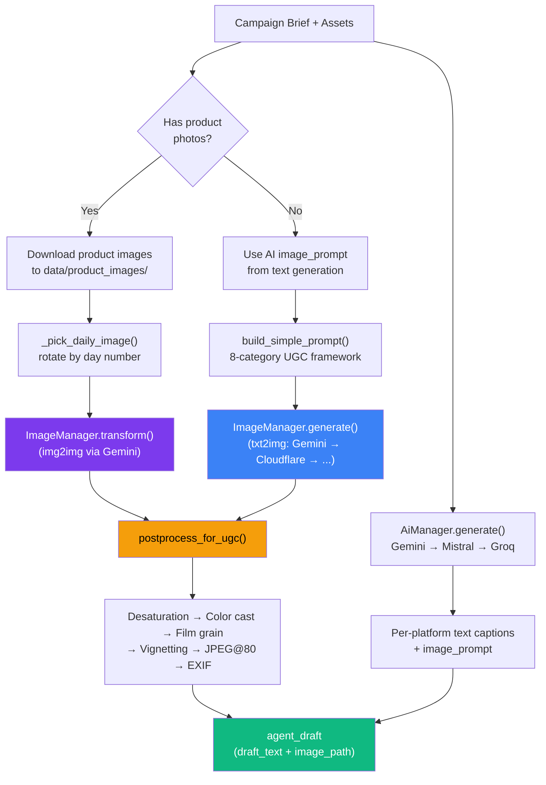
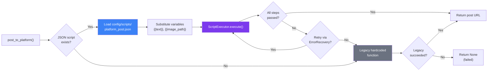
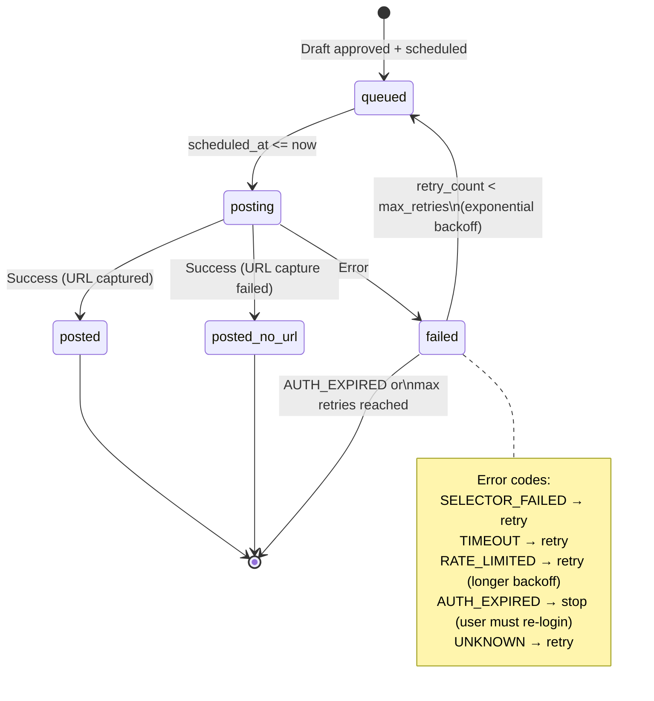

# Amplifier — Product Architecture

**Last Updated**: April 4, 2026

## System Overview

Amplifier is a two-sided marketplace: companies create campaigns, users (amplifiers) earn money by posting campaign content on their social media accounts. Three systems work together:

---

## 1. Amplifier Server (`server/`)

FastAPI + Supabase PostgreSQL (production) / SQLite (local dev). **LIVE at `https://api.pointcapitalis.com`** — Hostinger KVM 1 VPS (Mumbai, Ubuntu 24.04, systemd + Caddy, since 2026-04-25). See `docs/HOSTING-DECISION-RECORD.md`.

### Routes

~90 routes total across 3 route groups:

| Group | Router Files | Routes | Auth |
|---|---|---|---|
| **JSON API** (`/api/`) | auth.py, campaigns.py, invitations.py, users.py, metrics.py | 27 | JWT |
| **Admin Dashboard** (`/admin/`) | admin/ (11 files: login, overview, users, companies, campaigns, financial, fraud, analytics, review, audit, settings) | 36 | Admin cookie |
| **Company Dashboard** (`/company/`) | company/ (7 files: login, dashboard, campaigns, billing, influencers, stats, settings) | ~22 | Company JWT cookie |
| **System** | main.py | 2 | None |

### API Endpoints

**Auth (4 routes):**
- `POST /api/auth/register` — User registration → JWT
- `POST /api/auth/login` — User login → JWT
- `POST /api/auth/company/register` — Company registration → JWT
- `POST /api/auth/company/login` — Company login → JWT

**Company Campaigns (13 routes):**
- CRUD: create, list, get, update, delete (draft only)
- AI wizard: `POST /api/company/campaigns/ai-wizard` — scrapes company URLs, Gemini generates brief
- Reach estimate: `POST/GET /api/company/campaigns/reach-estimate`
- Operations: clone, budget top-up, export (CSV/JSON)

**User Campaigns (6 routes):**
- `GET /api/campaigns/mine` — poll for matched campaigns (triggers matching)
- `GET /api/campaigns/invitations` — pending invitations (auto-expires stale)
- `POST /api/campaigns/invitations/{id}/accept` — accept (tier-based limit)
- `POST /api/campaigns/invitations/{id}/reject` — reject
- `GET /api/campaigns/active` — active assignments
- `PATCH /api/campaigns/assignments/{id}` — update status

**User Profile (4 routes):**
- `GET/PATCH /api/users/me` — profile CRUD
- `GET /api/users/me/earnings` — earnings breakdown
- `POST /api/users/me/payout` — request withdrawal ($10 min)

**Posts & Metrics (2 routes):**
- `POST /api/posts` — batch register posted URLs
- `POST /api/metrics` — batch submit metrics (triggers billing)

**Admin Dashboard (36 routes across 11 routers):**
- Users: list, detail, suspend, unsuspend, ban, adjust trust (6 routes)
- Companies: list, detail, add/deduct funds, suspend, unsuspend (6 routes)
- Campaigns: list, detail, pause, resume, cancel (5 routes)
- Financial: list, run billing, run payout, run earning promotion, run payout processing (5 routes)
- Fraud: list, run trust check, approve/deny appeals (4 routes)
- Analytics, review queue, audit log, settings, login/logout (10 routes)

**Company Dashboard (~22 routes across 7 routers):**
- Login/register/logout, dashboard overview, campaign CRUD + wizard, billing + Stripe checkout, influencer performance, stats, settings

### Database Models (11 tables)

| Model | Key Fields | Purpose |
|---|---|---|
| **Company** | name, email, balance, `balance_cents` | Advertiser accounts |
| **Campaign** | title, brief, assets (JSON), budget_total/remaining, payout_rules (JSON), targeting (JSON), content_guidance, status, screening_status, max_users, company_urls | Campaign definitions |
| **User** | email, platforms (JSON), follower_counts (JSON), niche_tags, trust_score, mode, `tier` (seedling/grower/amplifier), `successful_post_count`, `earnings_balance_cents`, `total_earned_cents` | Creator accounts |
| **CampaignAssignment** | campaign_id, user_id, status, content_mode, payout_multiplier, invited_at, expires_at | Creator-campaign relationship |
| **Post** | assignment_id, platform, post_url, content_hash, status | Published social posts |
| **Metric** | post_id, impressions, likes, reposts, comments, clicks, is_final | Engagement measurements |
| **Payout** | user_id, campaign_id, `amount_cents`, status (pending/available/processing/paid/voided/failed), `available_at`, breakdown (JSON) | Earnings records |
| **Penalty** | user_id, post_id, reason, `amount_cents`, appealed, appeal_result | Trust violations |
| **CampaignInvitationLog** | campaign_id, user_id, event, event_metadata | Invitation audit trail |
| **AuditLog** | action, target_type, target_id, details, admin_ip | Admin action tracking |
| **ContentScreeningLog** | campaign_id, flagged, flagged_keywords, review_result | AI content moderation |

### Services (7)

| Service | File | Key Functions |
|---|---|---|
| **Matching** | `matching.py` | `get_matched_campaigns()` — hard filters + Gemini AI scoring (0-100) + niche-overlap fallback. Tier-based campaign limits (seedling:3, grower:10, amplifier:unlimited). Score cache (24h). |
| **Billing** | `billing.py` | `calculate_post_earnings_cents()` — all math in integer cents. `run_billing_cycle()` — incremental, dedup by metric ID, budget capping. `promote_pending_earnings()` — 7-day hold. `void_earnings_for_post()` — fraud clawback. `_check_tier_promotion()` — auto-promote (20 posts → grower, 100+trust>=80 → amplifier). Amplifier tier gets 2x CPM. See earning lifecycle below. |
| **Trust** | `trust.py` | `adjust_trust()` — events (+1 to -50). `detect_deletion_fraud()`, `detect_metrics_anomalies()` (>3x avg). `run_trust_check()`. Penalties created for negative events. |
| **Payments** | `payments.py` | `create_company_checkout()` — Stripe Checkout for top-up. `process_pending_payouts()` — auto-send via Stripe Connect (marks paid in test mode). `run_payout_cycle()` — batch process eligible users. |
| **Campaign Wizard** | `campaign_wizard.py` | `run_campaign_wizard()` — deep crawl URLs (BFS, 10 pages, 2 hops), Gemini generates brief + guidance + rates. `screen_campaign()` — AI content safety. `estimate_reach()` — count eligible users + follower sum. |
| **Storage** | `storage.py` | `upload_file()`, `delete_file()` — Supabase Storage or local fallback. `extract_text_from_file()` — PDF/DOCX text extraction. |

### Earning Lifecycle

### Reputation Tier Progression

### Utilities

| Utility | File | Purpose |
|---|---|---|
| **Crypto** | `server/app/utils/crypto.py` | AES-256-GCM encryption. `encrypt()`, `decrypt()`, `is_encrypted()`, `encrypt_if_needed()`. Key from `ENCRYPTION_KEY` env var (PBKDF2 derivation). |

### Web Dashboards

Both use blue `#2563eb` theme, DM Sans font, gradient stat cards, SVG Heroicons nav, shared `_nav.html` sidebar partial.

**Company Dashboard (10 pages):** Login/register, dashboard (KPIs, budget usage, ROI), campaigns list (search/filter/sort), create campaign (4-step form + AI wizard), campaign detail (stats, per-platform breakdown, creator table, invitation funnel, budget management), billing (Stripe checkout, allocations), influencers (cross-campaign performance), stats (analytics, trends), settings.

**Admin Dashboard (14 pages):** Login, overview (system KPIs, alerts), users (paginated + detail with assignments/posts/payouts/penalties), companies (paginated + detail with financials), campaigns (paginated + detail with assignments/posts/metrics), financial (payout dashboard + 4 action buttons: run billing, run payout, promote earnings, process payouts), fraud (penalties + trust check + appeals), analytics (per-platform stats), review queue (flagged campaigns, approve/reject), audit log (action history), settings (system config).

---

## 2. User App (`scripts/`)

Local Flask app on port 5222 + always-running background agent. All compute-heavy work happens on the user's device — credentials never leave the device.

### Flask App (`user_app.py`, 32+ routes)

5 tabs: Campaigns, Posts, Earnings, Settings, Onboarding.

- **Auth**: Login/register with server, session management
- **Onboarding**: 5-step (connect platforms via browser login → scrape profiles → select niches → set region/mode → enter AI keys)
- **Campaigns**: Poll server, accept/reject invitations, view campaign details, generate/regenerate content, approve/reject/edit drafts, approve-all batch, skip campaigns
- **Posts**: List all posts with metrics, timezone conversion
- **Earnings**: Total/pending/available breakdown, per-campaign, withdrawal
- **Settings**: Reconnect platforms, update profile, manage AI keys, mode toggle

### Background Agent (`background_agent.py`)

Always-running async agent with 6 task loops:

| Task | Interval | What It Does |
|---|---|---|
| **Execute due posts** | 60s | Find posts in `post_schedule` where `scheduled_at <= now`, execute via script engine, sync to server |
| **Generate daily content** | 120s | For each active campaign: generate text (AiManager), download product images, generate images (ImageManager with daily rotation), store drafts with image_path, auto-approve in full_auto mode |
| **Poll campaigns** | 10min | Fetch new invitations from server, sync statuses, detect cancelled/completed campaigns |
| **Check sessions** | 30min | Verify platform login sessions are alive, mark expired for re-auth |
| **Scrape metrics** | 60s | Check what's due (T+1h/6h/24h/72h), scrape engagement via Playwright, sync to server |
| **Refresh profiles** | 7 days | Re-scrape follower counts, bios, recent posts for all connected platforms |

### Content Generation Pipeline

Three content modes:

**Text → Text** (`ContentGenerator.generate()` via `AiManager`):
- Prompt includes campaign title, brief, content guidance, assets
- Generates per-platform captions (different tone/length per platform)
- Anti-repetition via previous hooks injection and day number
- Provider fallback: Gemini → Mistral → Groq (all free tier)

**Text → Image** (`ContentGenerator.generate_image()` via `ImageManager`):
- AI generates an `image_prompt` alongside text content
- `build_simple_prompt()` enhances it with 8-category UGC photorealism framework (realism trigger, camera, lighting, texture, color, composition, quality markers)
- Provider fallback: Gemini Flash Image (500 free/day) → Cloudflare FLUX.1 → Together AI → Pollinations → PIL
- Post-processing: desaturation (13%), warm/cool color cast, film grain (Gaussian sigma=8), vignetting (25%), JPEG at quality 80, EXIF injection (iPhone/Samsung/Pixel metadata)
- Negative prompt blocks stock/studio/AI aesthetics

**Image → Image** (`ContentGenerator.generate_image(product_image_path=...)` via `ImageManager.transform()`):
- Campaign product photos downloaded from `assets.image_urls` to `data/product_images/{campaign_id}/`
- `_pick_daily_image(images, day_number)` rotates through multiple photos (Day 1 → photo 0, Day 2 → photo 1, wraps around)
- `build_img2img_prompt()` creates transformation prompt
- Gemini multimodal `generate_content` with image input generates UGC scene
- Same post-processing pipeline applied
- Falls back to txt2img if img2img fails

### Posting Engine

Two-layer architecture: JSON script engine (primary) + legacy hardcoded functions (fallback).

**JSON Script Engine** (`scripts/engine/`, 6 modules):

| Module | Purpose |
|---|---|
| `script_parser.py` | Parse JSON into data models: PlatformScript, ScriptStep, SelectorTarget, DelayRange, WaitCondition, ErrorRecoveryConfig, SuccessSignal |
| `selector_chain.py` | Fallback selector chains — try 3+ selectors per element before failing. Supports: css, text, role, testid, aria-label, xpath, placeholder |
| `human_timing.py` | Per-step configurable delays (`delay_before_ms: {min, max}`), character-by-character typing with random speed (`typing_speed: {min, max}`) |
| `error_recovery.py` | Per-script strategies: retry_with_next_selector, navigate_back_and_retry, dismiss_and_continue (popup detection), queue_for_manual. Exponential backoff. |
| `script_executor.py` | 13 action types: goto, click, text_input, file_upload, keyboard, dispatch_event, wait_and_verify, scroll, evaluate, wait, screenshot, extract_url, browse_feed |

**JSON Scripts** (`config/scripts/`):

| Script | Steps | Key Techniques |
|---|---|---|
| `x_post.json` | 18 | Ctrl+Enter submit (bypasses overlay div), profile page URL extraction |
| `linkedin_post.json` | 12 | ClipboardEvent image paste into compose modal, "View post" dialog URL capture |
| `facebook_post.json` | 14 | ClipboardEvent image paste, profile URL fallback for URL capture |
| `reddit_post.json` | 16 | Shadow DOM Lexical editor JS focus, /submitted/?created= URL parsing |

**Execution flow**:

**Post lifecycle state machine**:

- Failed posts categorized: SELECTOR_FAILED, TIMEOUT, AUTH_EXPIRED, RATE_LIMITED, UNKNOWN
- Exponential backoff retry: 30min × 2^retry_count (max 3 retries)
- AUTH_EXPIRED skips retry (user must re-login)
- Execution log (JSON) stored for debugging

### Local Database (12 SQLite tables)

| Table | Key Fields | Purpose |
|---|---|---|
| `local_campaign` | server_id, title, brief, assets (JSON), content_guidance, payout_rules, status, company_name | Server campaign mirror |
| `agent_draft` | campaign_id, platform, draft_text, `image_path`, iteration, approved, posted | AI-generated content per platform per day |
| `post_schedule` | campaign_server_id, platform, scheduled_at, content, image_path, status, `error_code`, `execution_log`, `max_retries`, retry_count | Scheduled post queue with retry lifecycle |
| `local_post` | campaign_server_id, platform, post_url, content, synced | Published posts with server sync status |
| `local_metric` | post_id, impressions, likes, reposts, comments, clicks, is_final, reported | Scraped engagement |
| `local_earning` | campaign_server_id, amount, status | Per-campaign earnings |
| `scraped_profile` | platform (UNIQUE), follower_count, bio, engagement_rate, profile_data (JSON) | Per-platform profile data |
| `settings` | key, value | Key-value config. API keys auto-encrypted via `_SENSITIVE_KEYS` |
| `local_notification` | type, title, message, read | Desktop notification queue |
| `agent_research` | campaign_id, research_type, content, source_url | Campaign research findings |
| `campaign_posts` | campaign_server_id, platform, content, image_url, post_order | Pre-authored content for repost campaigns (deferred feature) |
| `agent_content_insights` | platform, pillar_type, avg_engagement_rate, best_performing_text | Content analytics |

---

## 3. AI Layer (`scripts/ai/`)

### Text Generation

| Component | File | Purpose |
|---|---|---|
| AiProvider | `provider.py` | Abstract base: name, is_connected, is_rate_limited, generate_text() |
| GeminiProvider | `gemini_provider.py` | 3-model fallback (2.5-flash → 2.0-flash → 2.5-flash-lite), 60s rate limit cooldown |
| MistralProvider | `mistral_provider.py` | mistral-small-latest |
| GroqProvider | `groq_provider.py` | llama-3.3-70b-versatile |
| AiManager | `manager.py` | Registry + priority ordering + auto-fallback. Picks connected + not-rate-limited first. |

### Image Generation

| Component | File | Purpose |
|---|---|---|
| ImageProvider | `image_provider.py` | Abstract base: text_to_image(), image_to_image(), supports_img2img |
| GeminiImageProvider | `image_providers/gemini_image.py` | PRIMARY. 500 free/day. txt2img via generate_images API. img2img via multimodal generate_content. |
| CloudflareImageProvider | `image_providers/cloudflare_image.py` | FLUX.1 Schnell. 20-50 free/day. |
| TogetherImageProvider | `image_providers/together_image.py` | FLUX.1 Schnell. $25 credit. |
| PollinationsImageProvider | `image_providers/pollinations_image.py` | Free, no signup, variable quality. |
| PilFallbackProvider | `image_providers/pil_fallback.py` | Dark gradient + white text. Last resort. |
| ImageManager | `image_manager.py` | Registry + fallback + auto post-processing after every generation. |
| Post-Processing | `image_postprocess.py` | UGC pipeline: desaturation, color cast, film grain, vignetting, JPEG compression, EXIF injection. Platform-specific resize. |
| Prompt Builder | `image_prompts.py` | 8-category photorealism framework. Randomized pools (cameras, lighting, textures, compositions). Negative prompt. |

---

## 4. Deployment & Infrastructure

### Server

| Component | Service | Details |
|---|---|---|
| API + Dashboards | Hostinger KVM 1 VPS (Mumbai) | uvicorn (1 worker, 127.0.0.1:8000) + Caddy reverse proxy + Let's Encrypt TLS. systemd `amplifier-web.service`. |
| Database | Supabase PostgreSQL | US East (aws-1-us-east-1). Transaction pooler port 6543. NullPool + `prepared_statement_cache_size=0` for pgbouncer. |
| File Storage | Supabase Storage | Campaign assets, screenshots. Local fallback for dev. |
| Payments | Stripe | Checkout for company top-ups. Connect Express for user payouts. Test mode unless keys set. |

### Environment Variables (Server)

| Variable | Required | Purpose |
|---|---|---|
| `DATABASE_URL` | Yes | PostgreSQL connection string |
| `JWT_SECRET_KEY` | Yes | Token signing |
| `ADMIN_PASSWORD` | Yes | Admin dashboard access |
| `ENCRYPTION_KEY` | Production | AES-256-GCM key for sensitive data. Dev fallback if not set. |
| `GEMINI_API_KEY` | For matching | AI scoring in matching service |
| `STRIPE_SECRET_KEY` | For payments | Real payment processing |
| `STRIPE_WEBHOOK_SECRET` | For payments | Webhook verification |
| `SUPABASE_URL` | For storage | File uploads |
| `SUPABASE_SERVICE_KEY` | For storage | Storage auth |

### User App

| Component | Details |
|---|---|
| Runtime | Python 3.9+ |
| Browser | Playwright Chromium (persistent profiles in `profiles/`) |
| Web UI | Flask on localhost:5222 |
| Database | SQLite with WAL mode (`data/local.db`) |
| AI | Free-tier APIs (Gemini, Mistral, Groq) + free image gen (Gemini, Cloudflare, Pollinations) |
| Dependencies | playwright, flask, httpx, google-genai, Pillow, numpy, piexif |

---

## 5. Key Design Decisions

| Decision | Rationale |
|---|---|
| **User-side compute** | AI generation, posting, and scraping run on user's device. Credentials never leave. Eliminates platform ban risk at scale. |
| **Pull-based architecture** | User app polls server. Server doesn't push to users. Simpler, works offline, no WebSocket infrastructure needed. |
| **Free AI APIs** | Content generation at $0/campaign. Gemini (500 img/day free), Mistral, Groq (text free). Unit economics are viable from day one. |
| **JSON script engine** | Platform posting defined in JSON, not Python. When Instagram changes a button label, update a JSON file — not code. |
| **Fallback selector chains** | 3+ selectors per element. One broken selector doesn't kill posting. Catches 80%+ of minor platform UI changes. |
| **Integer cents** | All money stored as cents (Integer), never floats. Eliminates rounding errors. Consistent with Stripe's API. |
| **7-day earning hold** | Fraud prevention window. Detect post deletion or fake metrics before paying out. Void earnings during hold period. |
| **Reputation tiers** | Seedling → Grower → Amplifier. Graduated trust. Higher tiers earn more (2x CPM) and get more automation. Incentivizes consistent quality. |
| **UGC post-processing** | Film grain, JPEG artifacts, and phone EXIF make AI images indistinguishable from phone photos. Models can't generate authentic grain — post-processing is the only way. |
| **img2img from campaign assets** | Companies upload product photos → AI generates lifestyle scenes featuring the real product. More authentic than pure txt2img (product actually looks right). Daily rotation through multiple photos. |
